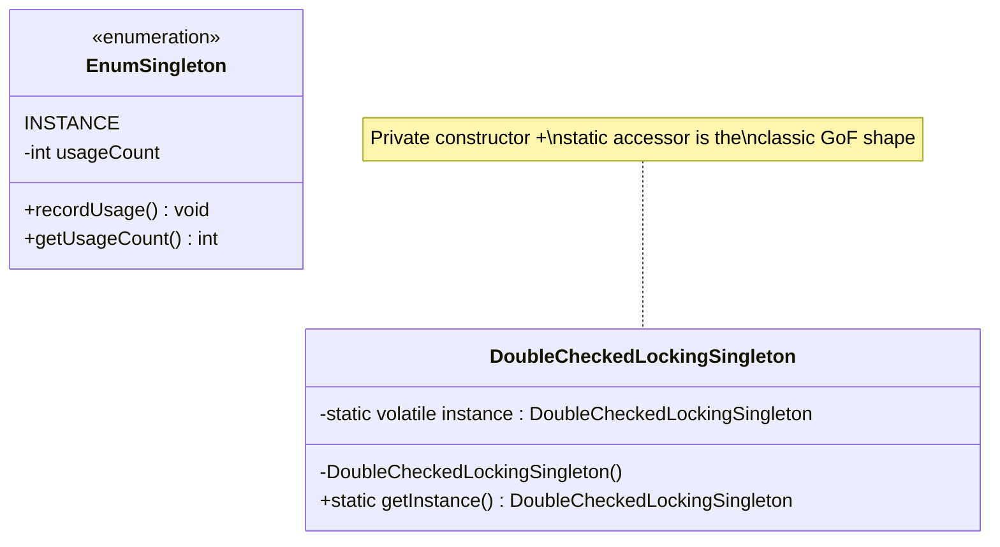
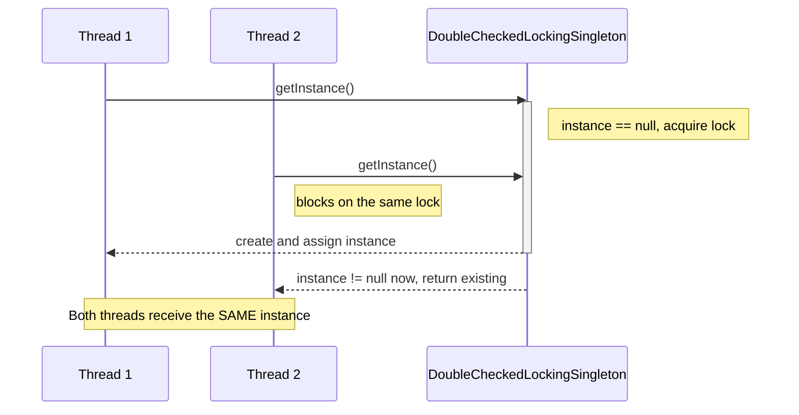

# 01 — Singleton

**Category:** Creational
**Difficulty:** ★☆☆☆☆ (start here)

## Intent

Ensure a class has exactly one instance, and provide a single global point of access to it.

## Real-world analogy

A country has exactly one government at a time. Departments don't each print their own — they
all go through the one that exists. If a second one popped into existence, every department that
already has a reference to the first would still be talking to a now-stale government while new
lookups get the second. That inconsistency is exactly the bug an unsynchronized singleton produces
under concurrency.

## UML





## Participants

| Class | Role |
|---|---|
| `NaiveSingleton` | Textbook lazy singleton — **broken** under concurrent first access |
| `ThreadSafeSingleton` | Correct but pays a lock on every call, forever |
| `DoubleCheckedLockingSingleton` | Correct, locks only until the instance exists |
| `EnumSingleton` | Idiomatic Java singleton (Effective Java, Item 3) |
| `spring/SingletonSpringConfig` | Shows the framework doing this for you |

## Why four implementations of the same thing?

This module is the on-ramp for the whole repo, so it deliberately shows the *evolution* of the
idea rather than jumping straight to the "correct" answer:

1. **`NaiveSingleton`** — the version most people write first. Two threads can both pass
   `if (instance == null)` before either finishes the assignment, so each ends up with its own
   object. `SingletonThreadSafetyTest` does not assert this is broken (a race that merely
   *usually* loses isn't a reliable test), but the README calls it out explicitly.
2. **`ThreadSafeSingleton`** — wraps the whole accessor in `synchronized`. Fixes the race, but
   every single call blocks on the lock even after `instance` is permanently non-null.
3. **`DoubleCheckedLockingSingleton`** — only synchronizes on the (rare) first call. Requires the
   field to be `volatile`, or a thread could observe a half-constructed object due to instruction
   reordering.
4. **`EnumSingleton`** — the form Josh Bloch recommends: the JVM guarantees a single instance per
   enum constant even under concurrent classloading, and it's immune to the reflection/
   serialization attacks that can create a second instance of a plain-class singleton.

## The Spring angle

In a Spring application you almost never hand-write a singleton — you let the container manage
it. `@Bean` methods are **singleton-scoped by default**: one instance per `ApplicationContext`,
shared by every injection point, with no private constructor or static accessor in sight. See
`spring/SingletonSpringConfig`, which puts a default-scoped bean next to a `@Scope("prototype")`
bean so you can see the *contrast* directly — the prototype bean creates a fresh instance on every
`getBean()`/injection, which is the closest thing to Gang-of-Four *Prototype* semantics available
through the container.

Run `SingletonDemo#main` (or `./gradlew :01-singleton:run`) to see both approaches side by side.

## When to use

- Exactly one instance must coordinate access to a shared resource (a connection pool, a cache, a
  hardware interface).
- The instance is effectively stateless configuration, or its state genuinely belongs to the
  whole process.

## When to avoid

- **It's global mutable state.** Singletons make unit testing harder (hidden shared state between
  tests) and hide dependencies (a class calling `Singleton.getInstance()` doesn't declare that
  dependency in its constructor).
- In a Spring app, prefer an injected singleton-scoped `@Bean` over a hand-rolled
  `getInstance()` — you get the same one-instance guarantee plus testability (swap in a mock via
  DI) for free.

## Run it

```bash
./gradlew :01-singleton:test   # unit tests, incl. a concurrent-access test
./gradlew :01-singleton:run    # runnable demo
```

## Related patterns

- **Factory Method** (`02-factory-method`) is often used to hide *which* singleton subtype gets
  created.
- **Abstract Factory** (`03-abstract-factory`) — factories are frequently themselves singletons.
- **Multiton** (not included) generalizes this to one instance per key instead of one instance
  globally.
