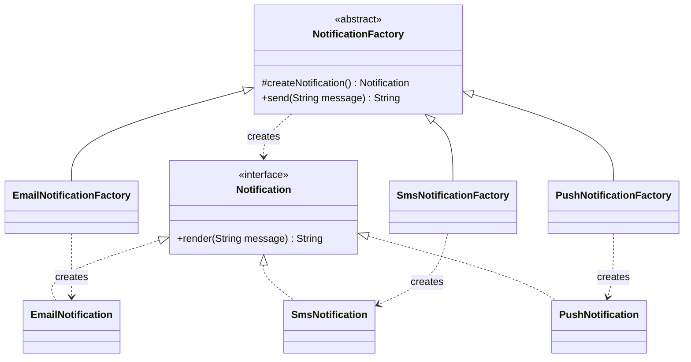
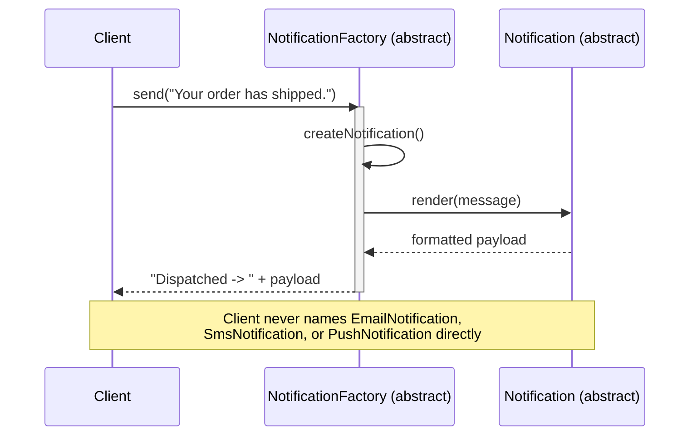

# 02 — Factory Method

**Category:** Creational
**Difficulty:** ★★☆☆☆

## Intent

Define an interface for creating an object, but let subclasses decide which class to instantiate.
Factory Method lets a class defer instantiation to subclasses while the class itself keeps working
purely against an abstract product type.

## Real-world analogy

A logistics company's `Transport` planning step is identical regardless of the vehicle: pick up
cargo, schedule the route, hand off for delivery. A `RoadLogistics` branch hands out a `Truck`, a
`SeaLogistics` branch hands out a `Ship` — the planning code never changes, only the factory
method that supplies the vehicle does.

## UML





## Participants

| Class | Role |
|---|---|
| `Notification` | Product interface — channel-specific rendering |
| `EmailNotification` / `SmsNotification` / `PushNotification` | Concrete products |
| `NotificationFactory` | Abstract creator — defines `send()` as a fixed template, `createNotification()` as the variable step |
| `EmailNotificationFactory` / `SmsNotificationFactory` / `PushNotificationFactory` | Concrete creators |
| `NotificationChannel` | Enum that maps a channel name to its concrete factory, for the demo's selection logic |

## Why the abstract creator matters

The temptation is to skip straight to:

```java
Notification n = switch (channel) {
    case "EMAIL" -> new EmailNotification();
    case "SMS" -> new SmsNotification();
    case "PUSH" -> new PushNotification();
};
```

That's a **simple factory** — a useful idiom, but not the GoF Factory Method pattern, and it has a
real cost: every caller that needs a notification repeats (or imports) that whole switch, and any
shared "what happens after I have a notification" logic (logging, retry, metrics) has nowhere to
live except duplicated next to each call site.

`NotificationFactory` inverts this. `send()` is `final` and lives in the *abstract* class: it is
the one piece of "what happens after creation" logic, written once, that works for every channel
because it only calls the abstract `createNotification()` step and the abstract `Notification`
interface. Adding a new channel means adding one new creator subclass — `send()` never changes and
never needs to know the new type exists. That's the actual test of whether you're using Factory
Method: can you add a new product without touching the code that uses the abstract creator?

## Factory Method vs. Abstract Factory

This module creates **one** product (`Notification`) by overriding a single factory method in a
subclass hierarchy. The next module, `03-abstract-factory`, creates a **family** of related
products (a button *and* a checkbox that must visually match) through composition — a client holds
a `GUIFactory` object rather than subclassing anything. Rule of thumb: Factory Method is about
*inheritance* varying a single product; Abstract Factory is about *composition* varying a whole
matched set of products.

## When to use

- A class can't anticipate which concrete type of object it needs to create.
- You want to localize the knowledge of "which concrete product" to one small subclass per
  variant, while a shared algorithm (here, `send()`) stays written exactly once.
- You expect new product variants to be added over time and want that to mean "add a class," not
  "edit a switch statement everywhere it's duplicated."

## When to avoid

- Only one product type will ever exist — plain construction is simpler and the extra hierarchy is
  pure ceremony.
- The variation is only in *configuration*, not *behavior* — a Builder or even a constructor
  parameter is a better fit than a whole subclass.

## Run it

```bash
./gradlew :02-factory-method:test
./gradlew :02-factory-method:run
```

## Related patterns

- **Abstract Factory** (`03-abstract-factory`) — creates families of related products instead of
  one; often implemented *with* Factory Methods internally.
- **Template Method** (`15-template-method`) — Factory Method is a specialization of Template
  Method where the varying step happens to be "create an object."
- **Singleton** (`01-singleton`) — concrete factories are frequently themselves singletons, since
  they usually hold no state.
