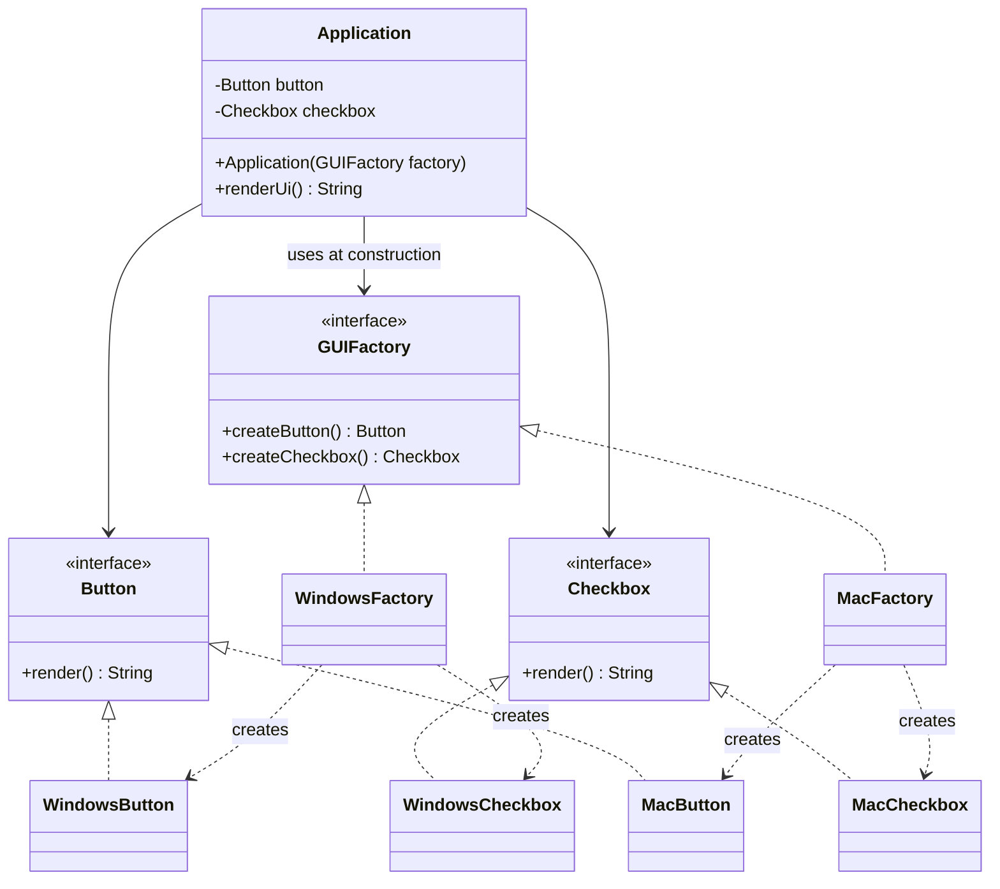

# 03 — Abstract Factory

**Category:** Creational
**Difficulty:** ★★★☆☆

## Intent

Provide an interface for creating **families of related or dependent objects** without specifying
their concrete classes, and guarantee that the objects produced together are always compatible
with each other.

## Real-world analogy

A furniture catalog sold in "Victorian" and "Modern" collections: a Victorian chair, sofa, and
coffee table are all designed to sit together, and so are the Modern versions — but a Victorian
chair next to a Modern coffee table looks wrong. Buying "from the Victorian factory" instead of
picking each piece individually is what keeps the set consistent.

## UML



## Participants

| Class | Role |
|---|---|
| `Button` / `Checkbox` | Abstract products — one interface per product *kind* in the family |
| `WindowsButton` / `WindowsCheckbox` | Concrete products, Windows family |
| `MacButton` / `MacCheckbox` | Concrete products, Mac family |
| `GUIFactory` | Abstract factory — one creation method per product kind |
| `WindowsFactory` / `MacFactory` | Concrete factories, each producing exactly one whole family |
| `Application` | Client — depends only on `GUIFactory`, `Button`, and `Checkbox` |

## Why one factory per family, not one factory method per product

The tempting shortcut is to give `Application` two independent factory methods, one for buttons
and one for checkboxes, and let each be selected separately. That reopens the exact bug this
pattern exists to prevent: nothing stops the button selector from choosing "Windows" while the
checkbox selector chooses "Mac." Binding `createButton()` and `createCheckbox()` to the *same*
`GUIFactory` instance is the mechanism that enforces consistency — the family is chosen exactly
once, at the point where a concrete `GUIFactory` is constructed, and every product pulled from it
afterward is guaranteed to match.

## Factory Method vs. Abstract Factory

- **Factory Method** (`02-factory-method`) varies **one product** through subclassing/overriding
  a single creation method. Its creators form an inheritance hierarchy.
- **Abstract Factory** varies **a family of several related products** through composition — a
  client holds one factory *object* with several creation methods, not several factory
  *subclasses* each overriding one method.

In fact, `WindowsFactory.createButton()` and `MacFactory.createButton()` are individually shaped
exactly like Factory Method — Abstract Factory can be seen as a set of Factory Methods bundled
behind one interface so they're always selected together.

## When to use

- Your system needs to work with multiple families of related products, and products from
  different families should never be mixed.
- You want to swap an entire family (e.g. themes, platforms, database vendors) by changing a
  single factory reference, not scattered `if` checks.

## When to avoid

- There's only one product kind, or products don't need to stay consistent with each other — plain
  Factory Method (or even direct construction) is simpler.
- Adding a new product *kind* (not a new family) means editing the `GUIFactory` interface and every
  concrete factory — Abstract Factory makes adding families cheap but adding product kinds
  expensive.

## Run it

```bash
./gradlew :03-abstract-factory:test
./gradlew :03-abstract-factory:run
```

## Related patterns

- **Factory Method** (`02-factory-method`) — the single-product building block this pattern
  composes several of.
- **Builder** (`04-builder`) — also constructs complex objects, but focuses on assembling one
  complex object step-by-step rather than choosing among matched product families.
- **Singleton** (`01-singleton`) — concrete factories like `WindowsFactory` are usually stateless
  and are often themselves singletons.
