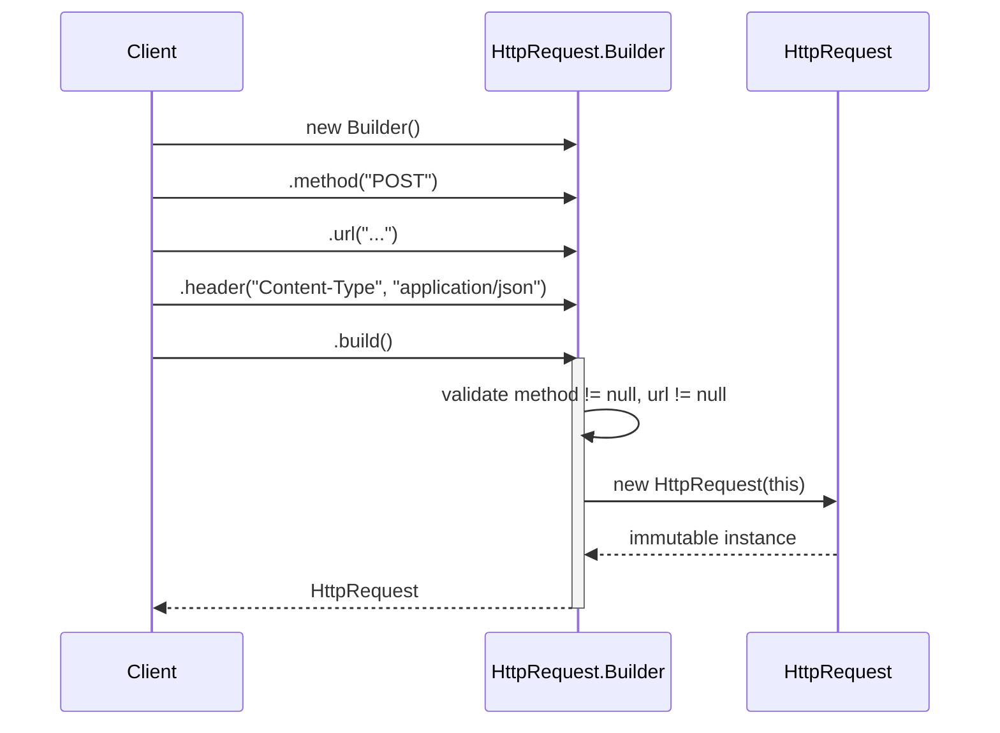

# 04 — Builder

**Category:** Creational
**Difficulty:** ★★☆☆☆

## Intent

Separate the construction of a complex object from its representation, so the same construction
process can produce different representations — and, in the modern idiom, so an object with many
optional parameters never needs a constructor overload for every combination of them.

## Real-world analogy

Ordering a sandwich at a counter: you specify bread, then optionally add cheese, then optionally
add toppings, then a size, and the sandwich is only handed over once you say "that's it." A
constructor `Sandwich(bread, cheese, lettuce, tomato, onion, mustard, size)` forces every caller to
pass something for every slot, most of the time `null`/`false`/defaults, in a fixed positional
order that's easy to get wrong. The counter's step-by-step, name-what-you-want process is Builder.

## UML

```mermaid
classDiagram
    class HttpRequest {
        -method : String
        -url : String
        -headers : Map~String,String~
        -body : String
        -timeout : Duration
        -HttpRequest(Builder)
        +method() String
        +url() String
        +headers() Map
        +body() String
        +timeout() Duration
    }
    class Builder {
        -method : String
        -url : String
        -headers : Map~String,String~
        -body : String
        -timeout : Duration
        +method(String) Builder
        +url(String) Builder
        +header(String, String) Builder
        +body(String) Builder
        +timeout(Duration) Builder
        +build() HttpRequest
    }
    HttpRequest +-- Builder : static nested
    Builder ..> HttpRequest : constructs

    class MealBuilder {
        <<interface>>
        +addMainCourse() void
        +addSide() void
        +addDrink() void
        +build() Meal
    }
    class VegMealBuilder
    class NonVegMealBuilder
    MealBuilder <|.. VegMealBuilder
    MealBuilder <|.. NonVegMealBuilder
    class Waiter {
        +construct(MealBuilder) Meal
    }
    Waiter ..> MealBuilder : directs
    MealBuilder ..> Meal : creates
```



## Participants

| Class | Role |
|---|---|
| `HttpRequest` | Immutable product of the modern fluent builder |
| `HttpRequest.Builder` | Static nested builder — fluent setters + validating `build()` |
| `Meal` | Product of the classic GoF builder trio |
| `MealBuilder` | Classic GoF Builder interface — fixed steps, no method chaining |
| `VegMealBuilder` / `NonVegMealBuilder` | Concrete classic builders |
| `Waiter` | Director — owns the *order* of construction steps |

## Why two builder styles on the same idea

**`HttpRequest.Builder`** is what almost all Java code means by "a builder" today: a static nested
class, fluent setters that return `this` for chaining, and a `build()` that validates required
fields (`method`, `url`) before handing back an object that has no public mutators at all —
`headers()` even returns an unmodifiable view so a caller can't mutate state after construction.
This is Effective Java Item 2's shape, and it's what Lombok's `@Builder` annotation generates for
you, and what Spring's `UriComponentsBuilder`, `ResponseEntity.BodyBuilder`, and dozens of other
`*Builder` classes in the ecosystem look like under the hood.

**`MealBuilder` + `Waiter`** shows the *original* GoF shape those modern builders evolved from: a
separate **Director** (`Waiter`) that owns the sequence of construction steps, and a builder
interface with void-returning steps rather than chained setters. The Director exists because the
original pattern assumed the *order and choice* of steps was itself worth encapsulating and
reusing across different builders — here, "main course, then side, then drink" is written once in
`Waiter.construct()` and reused verbatim for both a veg and a non-veg meal.

Fluent builders dropped the separate Director class because in most Java code the "assembly
sequence" is trivial and the caller is happy to write it inline as a chain of calls — but the
core idea (a dedicated object that accumulates state across method calls, then materializes it
into an immutable target with a `build()`-style step) is unchanged.

## When to use

- The target object has more than a couple of optional fields, and constructor telescoping (or a
  giant multi-arg constructor) is starting to hurt readability or invite argument-order bugs.
- The target object should be immutable once constructed — Builder is how you get immutability
  *and* incremental, named assembly instead of one big constructor call.
- (Classic GoF form specifically) the same assembly *sequence* needs to produce meaningfully
  different results depending on which concrete builder is plugged in.

## When to avoid

- Two or three constructor parameters, all required — a plain constructor (or a record) is less
  ceremony than a whole builder class.
- The object is naturally mutable and simple (a DTO with a handful of setters) — a builder adds
  indirection without buying anything.

## Run it

```bash
./gradlew :04-builder:test
./gradlew :04-builder:run
```

## Related patterns

- **Abstract Factory** (`03-abstract-factory`) — both assemble complex objects, but Abstract
  Factory returns the product immediately from one call, while Builder accumulates state across
  several calls before a final `build()`.
- **Prototype** (`05-prototype`) — an alternative to rebuilding a complex object from scratch each
  time: clone a pre-configured instance instead.
- **Factory Method** (`02-factory-method`) — a `Builder.build()` step is sometimes itself
  implemented via a Factory Method when the concrete product type varies.
