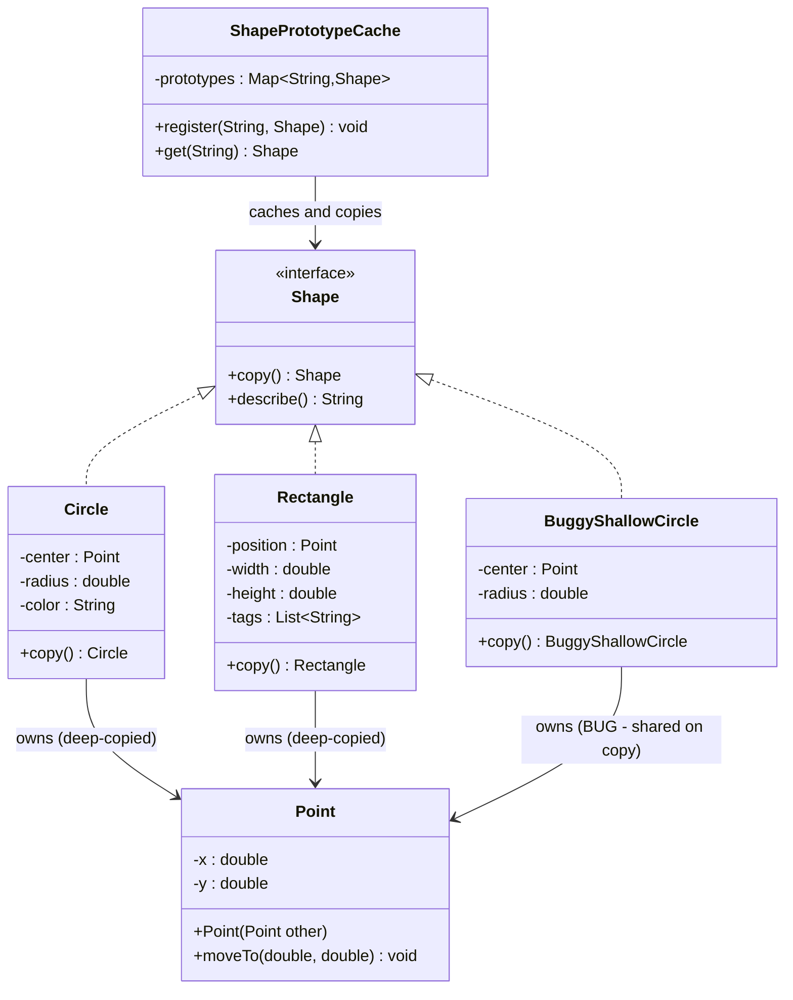
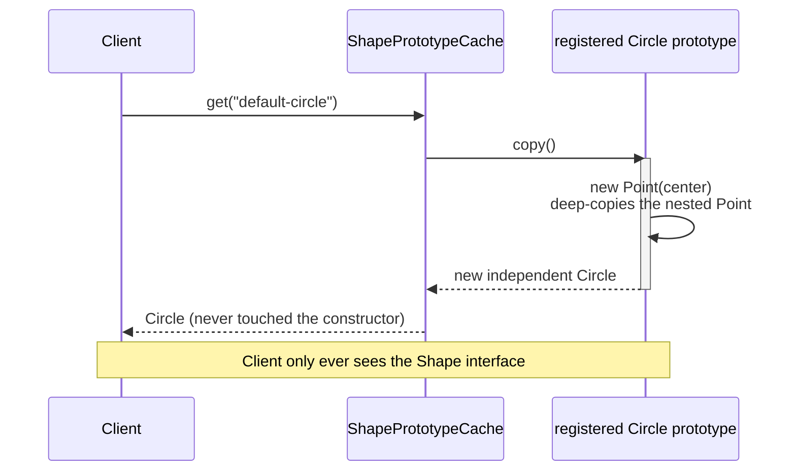

# 05 — Prototype

**Category:** Creational
**Difficulty:** ★★☆☆☆

## Intent

Specify the kinds of objects to create using a prototypical instance, and create new objects by
copying this prototype — avoiding both the cost of re-running expensive initialization and the
need for client code to depend on concrete classes at all.

## Real-world analogy

A cell doesn't get built from a blueprint every time one is needed — it divides from an existing
cell, copying its own structure. Biological mitosis is cheaper and more reliable than
re-synthesizing a cell from raw chemistry, which is exactly the trade-off Prototype makes for
objects that are expensive or complex to construct from scratch.

## UML





## Participants

| Class | Role |
|---|---|
| `Shape` | Prototype interface — `copy()` instead of `Object.clone()` |
| `Point` | Mutable nested value used to demonstrate shallow vs. deep copying |
| `Circle` / `Rectangle` | Concrete prototypes with **correct** deep-copying `copy()` |
| `BuggyShallowCircle` | Teaching-only concrete prototype with a **broken**, shallow `copy()` |
| `ShapePrototypeCache` | Registry of pre-configured prototypes, keyed by name, returning fresh copies |

## Why `copy()` instead of `Object.clone()`

`Cloneable` is a marker interface with no methods; the actual `clone()` behavior comes from
`Object`'s `protected native` method, which does a shallow field-for-field copy and throws a
checked `CloneNotSupportedException` unless the class implements the marker — a contract that
Josh Bloch (Effective Java) and most of the Java community consider broken by design. Getting it
right requires every class in a hierarchy to override `clone()` correctly, manually deep-copy
every mutable field, and still deal with the checked exception and unchecked cast. A plain
`copy()` method sidesteps all of it: it's ordinary polymorphism, the return type can be covariant
(`Circle.copy()` returns `Circle`, not `Shape`), and there's no marker interface to remember.

## Shallow vs. deep copy — the actual bug

`BuggyShallowCircle.copy()` looks completely reasonable:

```java
return new BuggyShallowCircle(center, radius);
```

It compiles, and a naive test that only checks `copy.radius() == original.radius()` passes. The
bug only shows up once someone *mutates* the copy: `copy.center().moveTo(99, 99)` moves the
original too, because both instances hold the same `Point` reference. `PrototypeCopyTest` proves
this explicitly in `shallowCopyBugMutatingTheCloneAlsoMovesTheOriginal`, then proves the fix
(`Circle.copy()` builds a new `Point` via `new Point(center)`) keeps the two independent in
`mutatingTheCopysNestedPointDoesNotAffectTheOriginal`. The same reasoning applies to
`Rectangle.tags()`: `copy()` calls `new ArrayList<>(tags)`, not just an assignment.

## Why a cache/registry at all

`ShapePrototypeCache` is the actual point of Prototype, not just a container: callers who want a
"default circle" call `cache.get("default-circle")` and receive an independent copy, without
constructing anything themselves and without importing `Circle` — only `Shape`. If a prototype
were expensive to build (loaded from disk, computed from a mesh, whatever), that cost is paid
exactly once, at registration, and every later `get()` is just an object copy.

## When to use

- Object construction is expensive (I/O, computation, complex initialization) but copying an
  already-built instance is cheap.
- You want to hand out pre-configured "template" objects without exposing or coupling callers to
  concrete classes.
- You need variations on a base configuration — clone the prototype, then tweak the copy.

## When to avoid

- Construction is already cheap — copying adds indirection for no benefit.
- The object graph is deep and mostly immutable already; a plain immutable value object (or
  Builder) is simpler than writing and maintaining a correct deep `copy()`.

## Run it

```bash
./gradlew :05-prototype:test
./gradlew :05-prototype:run
```

## Related patterns

- **Builder** (`04-builder`) — an alternative way to avoid re-running expensive/complex
  construction logic: assemble step-by-step instead of cloning a template.
- **Abstract Factory** (`03-abstract-factory`) — concrete factories are sometimes implemented by
  holding prototypes internally and cloning them instead of calling `new`.
- **Singleton** (`01-singleton`) — the opposite instinct: Prototype exists specifically to produce
  many independent instances cheaply, where Singleton guarantees exactly one.
