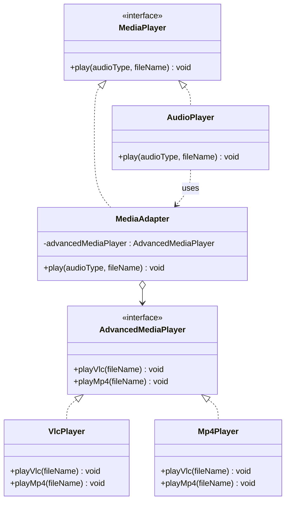
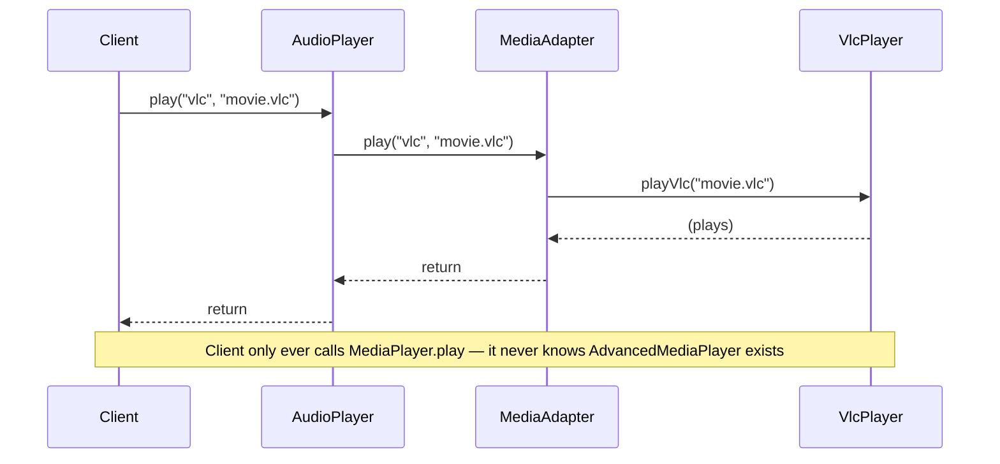

# 06 — Adapter

**Category:** Structural
**Difficulty:** ★★☆☆☆

## Intent

Convert the interface of a class into another interface clients expect. Adapter lets classes work
together that couldn't otherwise because of incompatible interfaces.

## Real-world analogy

A travel power plug adapter. The wall socket (the interface you have) and your laptop's plug (the
interface you need) were never designed to fit together, and you cannot redesign either one — the
wall is embedded in the building, the laptop was manufactured overseas. The adapter sits between
them, unchanged on both sides, translating one physical shape into the other.

## UML





## Participants

| Class | Role |
|---|---|
| `MediaPlayer` | Target interface the client codes against |
| `AdvancedMediaPlayer` | Adaptee interface — incompatible, third-party-style hierarchy |
| `VlcPlayer`, `Mp4Player` | Concrete adaptees implementing `AdvancedMediaPlayer` |
| `MediaAdapter` | Adapter — implements `MediaPlayer`, delegates to an `AdvancedMediaPlayer` |
| `AudioPlayer` | Client-facing player — native `mp3`, adapted `vlc`/`mp4` |

## Object adapter vs. class adapter

This module uses **object adapter** (composition: `MediaAdapter` holds an `AdvancedMediaPlayer`
reference), which is the idiomatic approach in Java since Java has no multiple inheritance of
classes. A "class adapter" would extend the adaptee directly and implement the target interface —
possible in languages with multiple inheritance, but in Java it would mean `MediaAdapter` extends
`VlcPlayer` *and* implements `MediaPlayer`, which only works for a single fixed adaptee at
compile time. Composition also means one `MediaAdapter` shape can wrap either `VlcPlayer` or
`Mp4Player` by picking the right adaptee at construction time, which is exactly what happens here.

## When to use

- You have an existing class (often from a third-party library you can't modify) whose interface
  doesn't match what the rest of your code expects.
- You want to introduce a reusable class that cooperates with classes it wasn't designed to work
  with, without changing either side.

## When to avoid

- If you control both interfaces and haven't shipped yet, just make them match — an adapter adds
  an indirection layer that has no reason to exist if there's no real incompatibility to bridge.
- Too many adapters stacked on top of each other are a sign the core abstractions need rethinking,
  not more translation layers.

## Run it

```bash
./gradlew :06-adapter:test
./gradlew :06-adapter:run
```

## Related patterns

- **Bridge** (`11-bridge`) looks structurally similar (both wrap another object) but is designed
  up front to keep two hierarchies independent, whereas Adapter is applied after the fact to
  reconcile an interface that already exists and can't change.
- **Decorator** (`07-decorator`) also wraps an object, but preserves the same interface while
  *adding* behavior; Adapter *changes* the interface to match what the client expects.
- **Facade** (`08-facade`) simplifies a broad subsystem behind one new interface; Adapter matches
  one existing interface to another that a client already depends on.
