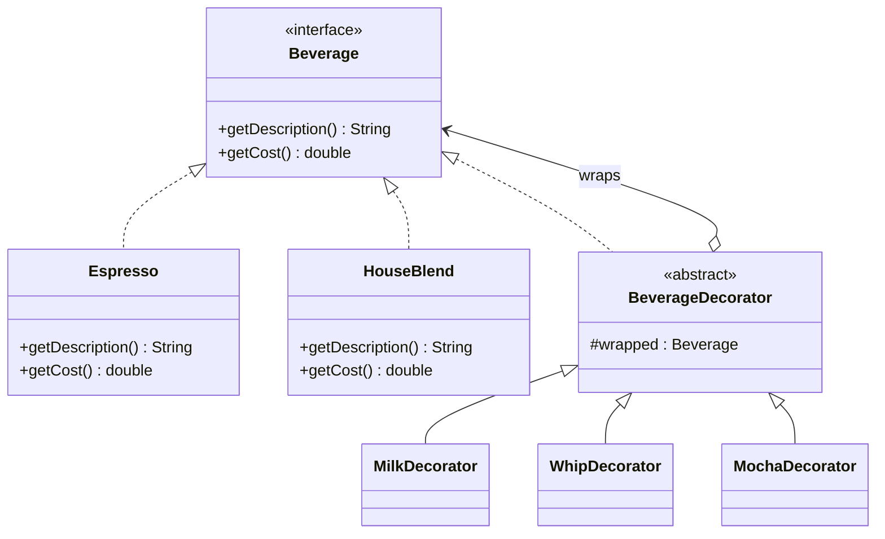
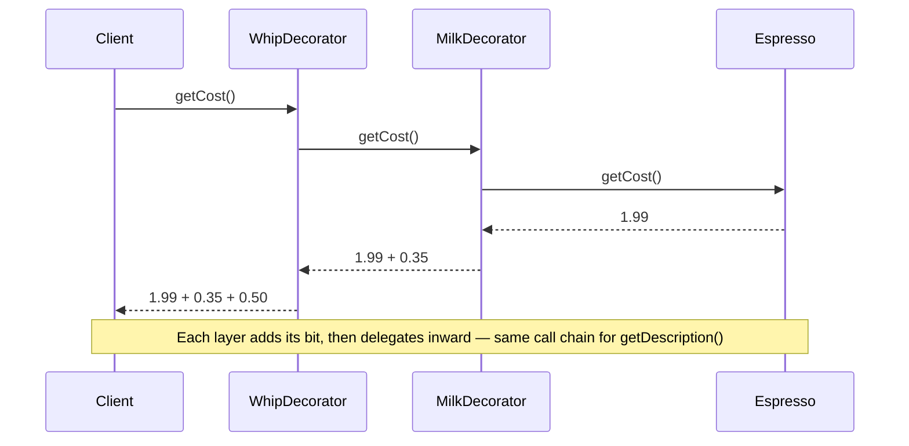

# 07 — Decorator

**Category:** Structural
**Difficulty:** ★★☆☆☆

## Intent

Attach additional responsibilities to an object dynamically. Decorators provide a flexible
alternative to subclassing for extending behavior.

## Real-world analogy

Ordering a coffee. You don't pick from a fixed menu of "Espresso", "EspressoWithMilk",
"EspressoWithMilkAndWhip" pre-made drinks — you start with a base drink and the barista layers
add-ons on top, one at a time, in whatever order and combination you ask for. Each add-on knows
only how to modify what it's wrapped around; it has no idea what's underneath it or what might get
added on top of it next.

## UML





## Participants

| Class | Role |
|---|---|
| `Beverage` | Component interface shared by base drinks and decorators |
| `Espresso`, `HouseBlend` | Concrete components — base drinks with their own cost/description |
| `BeverageDecorator` | Abstract decorator — holds the wrapped `Beverage`, implements the same interface |
| `MilkDecorator`, `WhipDecorator`, `MochaDecorator` | Concrete decorators — each adds to cost and description |

## Why not just subclass?

Subclassing gives you a combinatorial explosion. With N base drinks and M independent add-ons,
covering every combination as a subclass needs up to N × M classes —
`EspressoWithMilk`, `EspressoWithWhip`, `EspressoWithMilkAndWhip`, `HouseBlendWithMilk`, and so on
— and every new add-on multiplies the count again. Worse, the set of combinations is fixed at
compile time: you can't build "milk, then whip, then milk again" without yet another subclass.

Decorator flips this to composition: N base classes + M decorator classes, and any of the M
decorators can wrap any `Beverage` (a base component *or* another decorator) in any order, any
number of times, chosen at **runtime**. `new WhipDecorator(new MilkDecorator(new Espresso()))` is
just object composition — no new class was needed to get that specific combination.

This is exactly the shape of `java.io`'s I/O streams: `new BufferedReader(new
InputStreamReader(new FileInputStream(file)))` wraps a `FileInputStream` in layers that each add
one capability (byte-to-char decoding, then buffering) without `FileInputStream` or
`InputStreamReader` needing to know about each other or about buffering at all. That's the
canonical real-world Java example of this exact pattern.

## When to use

- You need to add responsibilities to individual objects, not to an entire class, and want to add
  or remove them at runtime.
- Extension by subclassing would be impractical because of the number of independent extensions
  possible (the N × M problem above).

## When to avoid

- If there are only one or two fixed combinations you'll ever need, plain subclassing or even a
  configuration flag is simpler and easier to trace than a stack of wrapper objects.
- Deeply nested decorator chains can be hard to debug — a stack trace through six layers of
  wrapping is harder to read than one straight-line method.

## Run it

```bash
./gradlew :07-decorator:test
./gradlew :07-decorator:run
```

## Related patterns

- **Adapter** (`06-adapter`) also wraps an object, but changes the interface to match what a
  caller expects; Decorator keeps the same interface and adds behavior.
- **Composite** (`09-composite`) is structurally similar (recursive composition) but models
  part-whole hierarchies, not layered behavior on a single object.
- **Chain of Responsibility** (`19-chain-of-responsibility`) also delegates down a chain, but each
  link decides whether to handle a request at all, not how to augment its result.
