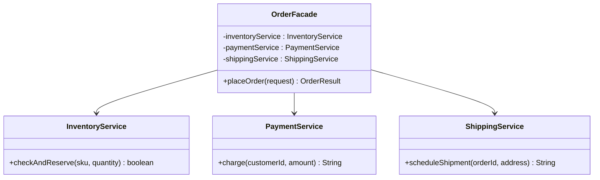
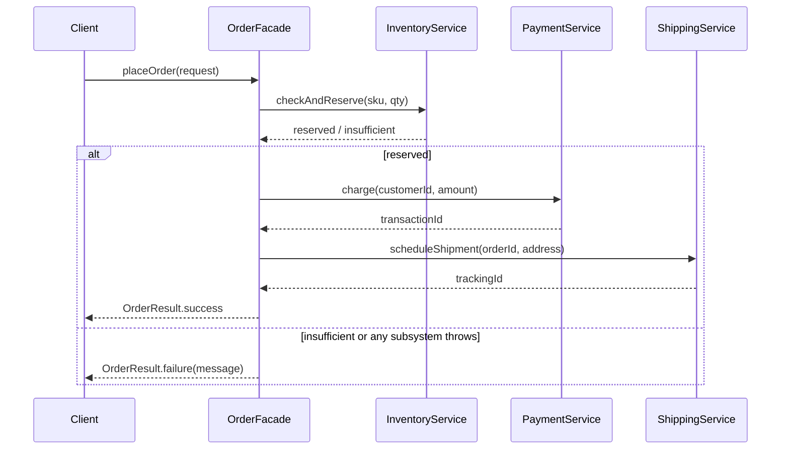

# 08 — Facade

**Category:** Structural
**Difficulty:** ★☆☆☆☆

## Intent

Provide a unified, higher-level interface to a set of interfaces in a subsystem. Facade defines a
simpler entry point that makes the subsystem easier to use, without hiding the subsystem itself
from callers who still need direct access to it.

## Real-world analogy

A hotel concierge. Booking a restaurant, arranging a taxi, and getting theater tickets are each
their own phone call, their own process, their own possible failure. You could make all three
calls yourself — or you tell the concierge "I'd like a nice evening out" and one person coordinates
all three, in the right order, and tells you if any part fell through. The restaurant, the taxi
company, and the box office still exist and still work exactly as before; the concierge just gives
you one door to knock on.

## UML





## Participants

| Class | Role |
|---|---|
| `OrderFacade` | Facade — exposes one `placeOrder` method, hides subsystem coordination |
| `InventoryService` | Subsystem — checks and reserves stock |
| `PaymentService` | Subsystem — charges the customer |
| `ShippingService` | Subsystem — schedules the shipment |
| `OrderRequest` / `OrderResult` | Simple data carriers in and out of the facade |

## One call vs. many decisions

Without `OrderFacade`, a caller placing an order has to know, and get right, every one of these on
its own:

1. Call `inventoryService.checkAndReserve(sku, qty)` — and know to do this *first*.
2. Check its boolean result and branch — inventory failure means stop, don't charge anyone.
3. Call `paymentService.charge(customerId, amount)` — wrapped in its own try/catch for
   `PaymentException`.
4. Only then call `shippingService.scheduleShipment(orderId, address)` — wrapped in its own
   try/catch for `ShippingException`.
5. Decide what "the order failed" even means to a caller when the failure could be a `boolean
   false`, or any of three different unchecked exception types, thrown from three different
   places.

That's three subsystem calls, one ordering constraint, and three different failure shapes a caller
would otherwise have to know about and handle individually. `OrderFacade.placeOrder(request)`
collapses all of it to one call and one result type (`OrderResult`) with a `success` flag and a
`message` — the caller doesn't need to know `InventoryService`, `PaymentService`, or
`ShippingService` exist at all, and a subsystem failure never leaks as a raw exception.

## When to use

- A subsystem has several classes/steps that almost always get used together in the same
  sequence, and most callers only need the common-path outcome.
- You want to decouple client code from a subsystem's internals so the subsystem can evolve (add
  a fraud-check step, swap a shipping carrier) without every caller changing.

## When to avoid

- Don't force *every* caller through the facade if some genuinely need fine-grained subsystem
  access (e.g. an admin tool that needs to query `InventoryService` directly) — Facade is meant to
  add a simple path, not remove the subsystem's own public API.
- A facade that just forwards one call to one subsystem method, with no real coordination, is an
  unnecessary layer — the pattern earns its keep by hiding *multiple* steps and their ordering.

## Run it

```bash
./gradlew :08-facade:test
./gradlew :08-facade:run
```

## Related patterns

- **Adapter** (`06-adapter`) matches one existing interface to another; Facade defines a brand
  new, simpler interface over several existing ones.
- **Mediator** (`20-mediator`) also centralizes coordination, but between peer objects that talk
  to *each other*, whereas a facade's subsystems don't need to know the facade exists.
- **Abstract Factory** (`03-abstract-factory`) can be used alongside Facade to supply the
  subsystem objects a facade wraps, keeping their construction decoupled too.
