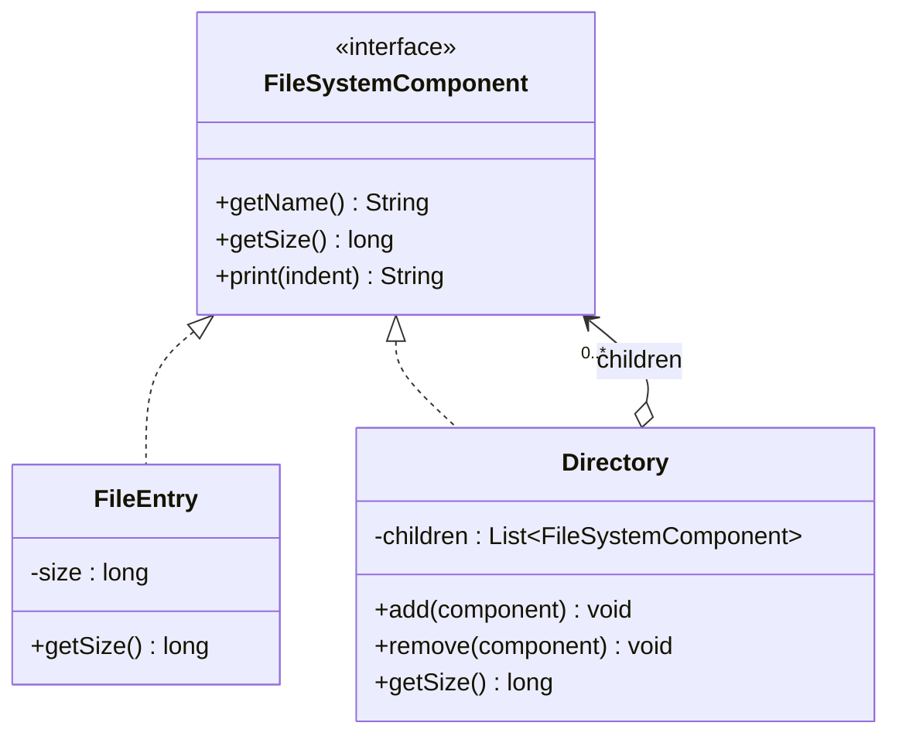
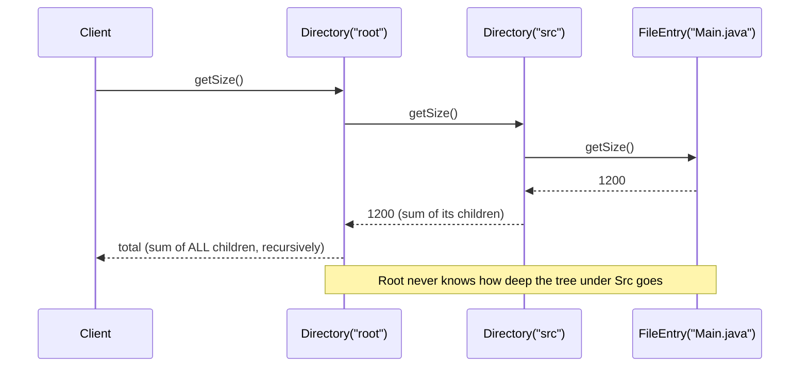

# 09 — Composite

**Category:** Structural
**Difficulty:** ★★★☆☆

## Intent

Compose objects into tree structures to represent part-whole hierarchies. Composite lets clients
treat individual objects and compositions of objects uniformly, through a single shared interface.

## Real-world analogy

A file explorer window. You can right-click a single file and see "Size: 4 KB", or right-click a
folder and see "Size: 128 MB" — the same context menu, the same "Size" field, whether you clicked
a leaf or an entire subtree. The folder doesn't have a fundamentally different API from the file;
it just happens to compute its size by asking everything inside it.

## UML





## Participants

| Class | Role |
|---|---|
| `FileSystemComponent` | Component interface — shared by leaves and composites |
| `FileEntry` | Leaf — a file with a fixed size, no children |
| `Directory` | Composite — holds children, computes its size/print recursively |

## Uniform treatment is the whole point

The one thing worth internalizing about Composite: **client code never asks "is this a leaf or a
composite?"**. `Directory.getSize()` doesn't check `if (child instanceof FileEntry)` — it just
calls `child.getSize()` on every element of its `children` list and trusts the interface. Whether
that child is a single `FileEntry` or a `Directory` with a thousand descendants of its own is
irrelevant to the caller; the recursion bottoms out naturally at the leaves, which simply return
their own fixed size instead of iterating over anything.

This is what makes arbitrary nesting depth "free": adding a new level of subdirectories requires
zero changes to `Directory.getSize()` or `Directory.print()` — the same method that summed two
children correctly also sums two hundred nested nine levels deep, because from any one
`Directory`'s point of view it's still just "sum what my direct children report."

## When to use

- Your domain is naturally a part-whole hierarchy (file systems, UI widget trees, org charts,
  arithmetic expression trees) and you want operations (size, render, total cost) that apply the
  same way to a single element or an entire subtree.
- You want client code to stop caring whether it's holding one object or a collection of them.

## When to avoid

- If the "whole" can only ever contain a fixed, small set of specific child types with genuinely
  different operations (not just different data), forcing them through one shared interface can
  hide real differences that callers actually need to branch on.
- Overly generic composites (adding `add`/`remove` to a class that will realistically never have
  children) add API surface for no behavioral benefit.

## Run it

```bash
./gradlew :09-composite:test
./gradlew :09-composite:run
```

## Related patterns

- **Decorator** (`07-decorator`) also wraps `FileSystemComponent`-shaped objects recursively, but
  each decorator wraps exactly one component to add behavior, not many to represent a whole.
- **Iterator** (`17-iterator`) is commonly paired with Composite to walk a tree without exposing
  its internal structure to the client.
- **Visitor** (`22-visitor`) is often layered on top of a Composite tree when you need to add new
  operations (beyond `getSize`/`print`) without modifying every component class again.
