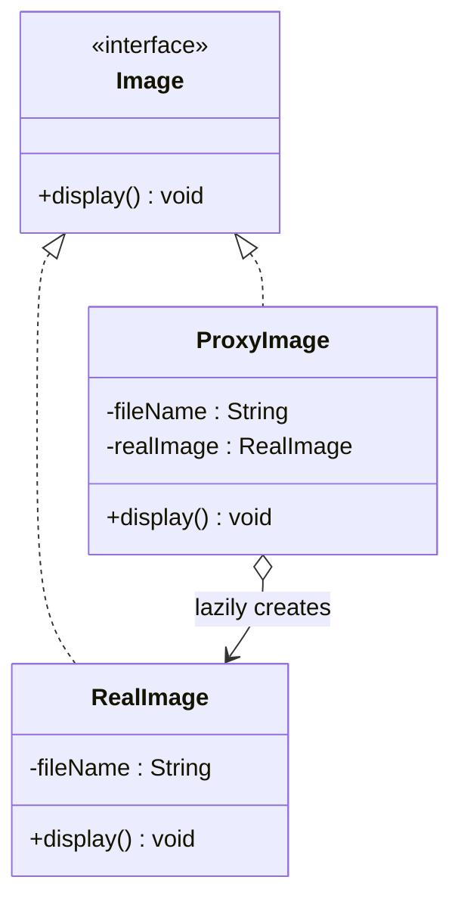
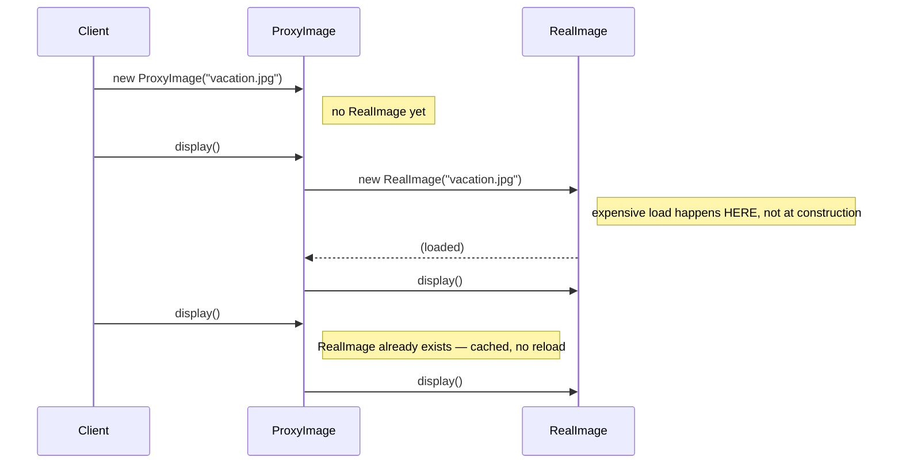

# 10 — Proxy

**Category:** Structural
**Difficulty:** ★★★☆☆

## Intent

Provide a surrogate or placeholder for another object to control access to it. A proxy implements
the same interface as the real object, so it can stand in for it anywhere the real object could
appear, while adding its own behavior around the actual work.

## Real-world analogy

A building receptionist. Visitors don't walk straight to the CEO's office — they talk to the
receptionist first, who has the exact same job title's worth of authority to say "go ahead" that
the CEO's calendar would give if you had direct access, but who can also make a visitor wait, log
who came in, or turn someone away entirely. The visitor's experience of "getting to see the CEO"
looks the same either way; what differs is everything the receptionist does around that access.

## UML





## Participants

| Class | Role |
|---|---|
| `Image` | Subject interface shared by real and proxy |
| `RealImage` | Real subject — expensive to construct |
| `ProxyImage` | Virtual proxy — defers `RealImage` construction until first `display()` |
| `spring/AccountService` | Subject interface for the Spring AOP comparison |
| `spring/DefaultAccountService` | Real subject Spring proxies |
| `spring/LoggingMethodInterceptor` | Advice woven around every call by `ProxyFactory` |

## The same shape, different reasons to intercept

"Proxy" isn't one technique, it's a family that all share the identical structural trick — a
stand-in implementing the real object's interface — applied for different reasons:

- **Virtual proxy** (this module's `ProxyImage`) — defers expensive creation until it's actually
  needed. If a client builds a hundred `ProxyImage`s but only ever calls `display()` on three, only
  three `RealImage`s ever get constructed.
- **Protection proxy** — checks permissions before forwarding a call, refusing or altering it for
  callers who shouldn't have access, without the real object needing any awareness of who's
  asking.
- **Remote proxy** — stands in for an object that actually lives in another process/machine (this
  is literally what RMI stubs and gRPC-generated clients are), making a network call look like a
  local method call.
- **Logging / monitoring proxy** (the Spring AOP half of this module) — wraps calls to record what
  happened, how long it took, or whether it threw, without the real object doing any of that
  bookkeeping itself.

## Hand-rolled proxy vs. Spring AOP

`ProxyImage` is a proxy we wrote by hand: a class that implements `Image`, holds a reference it may
or may not have created yet, and forwards to it. The Spring half of this module —
`ProxyFactory factory = new ProxyFactory(target); factory.addAdvice(new
LoggingMethodInterceptor()); AccountService proxy = (AccountService) factory.getProxy();` —
achieves the *same structural outcome* (an `AccountService` that isn't `DefaultAccountService`,
but behaves like one while doing extra work around every call) without us writing a
`LoggingAccountServiceProxy implements AccountService` class by hand. Because `AccountService` is
an interface, Spring generates a **JDK dynamic proxy** at runtime (`java.lang.reflect.Proxy`) that
implements it and routes every call through the configured `MethodInterceptor` chain before
reaching the real target. Had the target been a concrete class with no interface, Spring would
fall back to a CGLIB subclass proxy instead — same idea, different mechanism for producing the
stand-in class.

## When to use

- Object creation or the operation itself is expensive, and you want to defer or avoid it until
  it's genuinely needed (virtual proxy).
- You need to add cross-cutting behavior — logging, caching, access control, retry — around calls
  to an object without modifying that object's own code (protection/logging proxy, or Spring AOP
  in a framework-managed codebase).
- The real object lives somewhere else entirely (remote proxy).

## When to avoid

- If the wrapped operation is cheap, a proxy just adds an indirection layer with no payoff.
- Overusing framework-generated proxies (Spring AOP, etc.) for logic that's actually core business
  behavior can hide what a class does behind "magic" that's harder to trace than an explicit call.

## Run it

```bash
./gradlew :10-proxy:test
./gradlew :10-proxy:run
```

## Related patterns

- **Adapter** (`06-adapter`) also wraps an object, but to present a *different* interface;
  Proxy presents the *same* interface as the real subject.
- **Decorator** (`07-decorator`) wraps an object to add behavior too, but a decorator's whole
  purpose is to be stacked arbitrarily; a proxy typically controls access to exactly one specific
  real subject.
- **Facade** (`08-facade`) simplifies access to a whole subsystem; Proxy controls access to a
  single object that a client thinks it's talking to directly.
