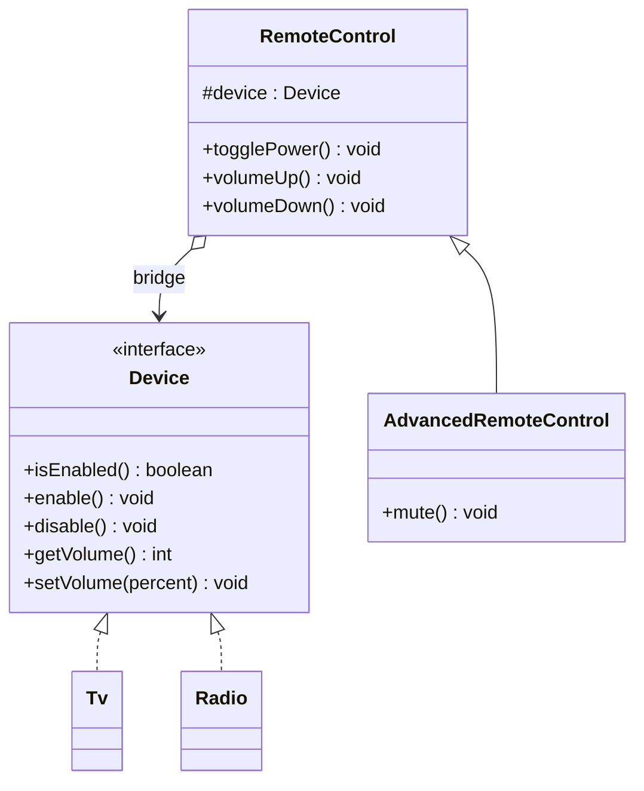
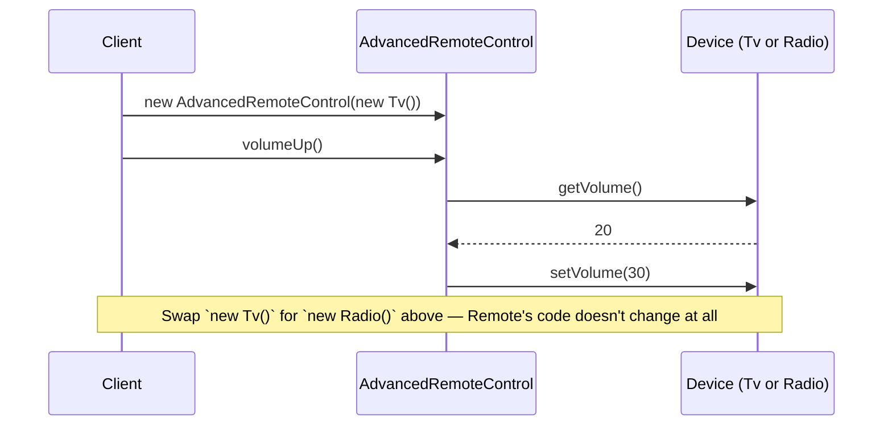

# 11 — Bridge

**Category:** Structural
**Difficulty:** ★★★☆☆

## Intent

Decouple an abstraction from its implementation so the two can vary independently. Bridge splits a
class hierarchy that would otherwise grow in two dimensions at once into two separate hierarchies
connected by composition.

## Real-world analogy

A universal remote control. The remote's buttons (power, volume) don't care whether they're
pointed at a TV, a radio, or a sound bar — the *abstraction* of "a remote with these controls" is
completely separate from the *implementation* of "how this particular device turns volume up."
You can buy a fancier remote with more buttons without the TV manufacturer changing anything, and
a manufacturer can ship a new device model without any existing remote needing an update — as long
as both sides agree on the same `Device`-shaped contract.

## UML





## Participants

| Class | Role |
|---|---|
| `Device` | Implementor interface — the hierarchy that can vary independently |
| `Tv`, `Radio` | Concrete implementors |
| `RemoteControl` | Abstraction — holds a `Device` by composition |
| `AdvancedRemoteControl` | Refined abstraction — adds `mute()` on top of `RemoteControl` |

## Two hierarchies growing independently

Without Bridge, "a remote for a device" tempts you into inheritance: `TvRemote extends Remote`,
`RadioRemote extends Remote`, then someone wants an `AdvancedTvRemote` and an `AdvancedRadioRemote`
— now every new remote *feature* multiplies against every device *type*, the same N × M explosion
Decorator solves for wrapping and Bridge solves for whole class hierarchies. Adding a `SoundBar`
device would mean writing `SoundBarRemote` and `AdvancedSoundBarRemote` too, even though nothing
about "how a remote's buttons work" actually changed.

Bridge fixes this by making `RemoteControl` hold a `Device` reference instead of extending a
device-specific class. `RemoteControl` and `AdvancedRemoteControl` form one hierarchy (remote
*features*); `Tv` and `Radio` form a completely separate hierarchy (device *implementations*). Add
a `SoundBar implements Device` and `AdvancedRemoteControl` already works with it — zero remote-side
code changes. Add a `PictureInPictureRemote extends RemoteControl` and it already works with `Tv`,
`Radio`, and `SoundBar` — zero device-side code changes. That's the "vary independently" promise:
N remotes + M devices, not N × M classes.

## Bridge vs. Adapter

These two look alike in code — both hold a wrapped object and delegate to it — but they solve
different problems at different times:

- **Adapter** (`06-adapter`) is applied *after the fact*, to reconcile an interface that already
  exists and that you can't change (a third-party library's API) with the interface your client
  code expects. It's a patch for an incompatibility that already happened.
- **Bridge** is designed *up front*, before either hierarchy grows, specifically so abstraction and
  implementation can each evolve on their own. Nothing here is "incompatible" — `RemoteControl`
  and `Device` were designed together to be decoupled from day one.

## When to use

- You anticipate a class needs to vary along two independent dimensions (feature set × underlying
  implementation) and inheritance alone would force a combinatorial subclass explosion.
- You want to swap an implementation at runtime (inject a different `Device` into an existing
  `RemoteControl` instance) rather than being locked in at compile time by inheritance.

## When to avoid

- If there's genuinely only one dimension of variation (only ever one kind of device, or only ever
  one kind of remote), the extra abstraction/implementor split is unneeded indirection.
- Introducing Bridge speculatively, before a second dimension of variation actually exists, adds
  complexity for a flexibility you may never use.

## Run it

```bash
./gradlew :11-bridge:test
./gradlew :11-bridge:run
```

## Related patterns

- **Adapter** (`06-adapter`) — see the contrast above; same shape, different intent and timing.
- **Abstract Factory** (`03-abstract-factory`) can be used to hand a `RemoteControl` the right
  family of `Device` objects for a given platform.
- **Strategy** (`13-strategy`) is structurally almost identical to Bridge (composition over an
  interface) but Strategy swaps a single *algorithm*, while Bridge decouples a whole *hierarchy*
  of abstractions from a whole hierarchy of implementations.
