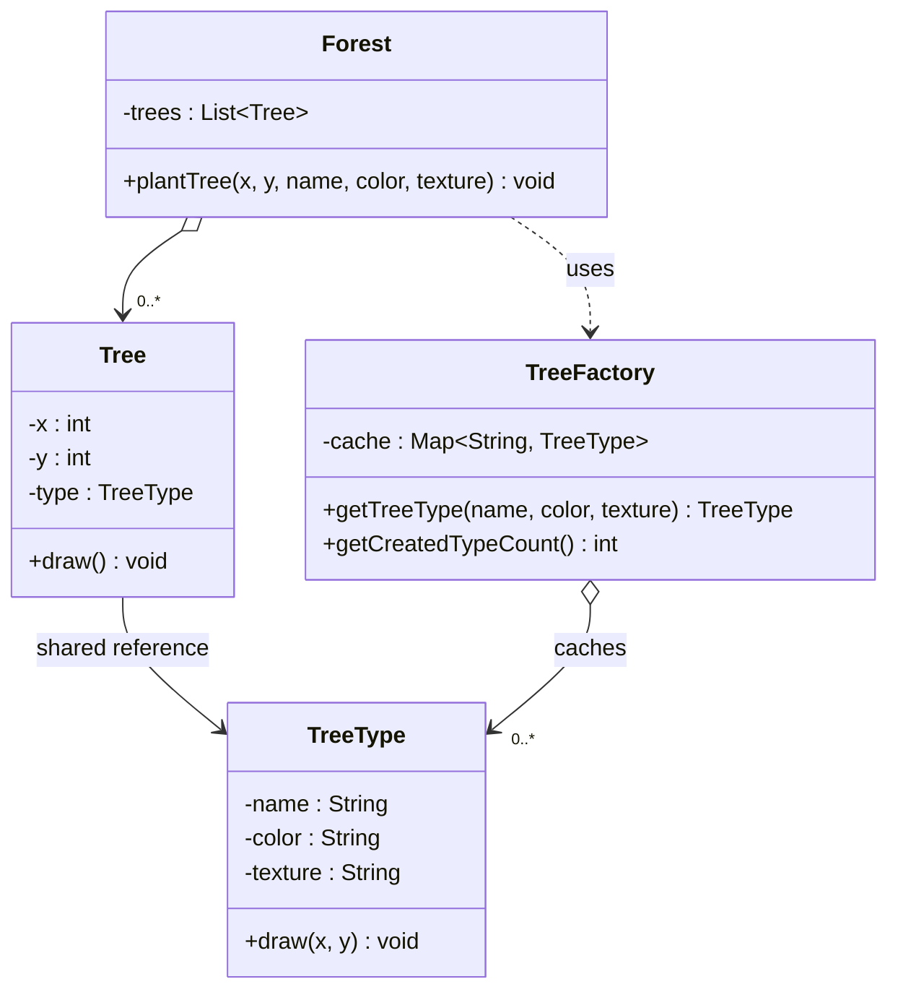
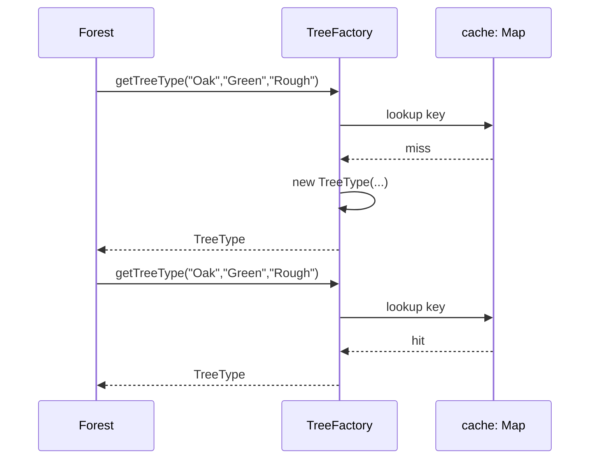

# 12 — Flyweight

**Category:** Structural
**Difficulty:** ★★★★☆

## Intent

Use sharing to support large numbers of fine-grained objects efficiently, by splitting an object's
state into **intrinsic** state (shared, context-independent) and **extrinsic** state (unique per
instance, supplied by the caller) so the shared part only ever needs to exist once.

## Real-world analogy

A print shop's letterpress type. There aren't 10,000 physical metal letter-A blocks sitting in a
warehouse for a 10,000-word document — there's one letter-A block, reused every time an "A" needs
to print, at whatever position on the page the typesetter places it. The block itself (its shape,
its font, its material) is shared and doesn't change; the position on the page is different every
single time it's used.

## UML





## Participants

| Class | Role |
|---|---|
| `TreeType` | Flyweight — immutable intrinsic (shared) state: name, color, texture |
| `TreeFactory` | Flyweight factory — caches and reuses `TreeType` instances by key |
| `Tree` | Context object — extrinsic (per-instance) state: x, y, plus a shared `TreeType` reference |
| `Forest` | Client-facing collection — plants trees, holds `List<Tree>` |

## Intrinsic vs. extrinsic, and why it matters

The entire pattern hinges on correctly splitting state into two categories:

- **Intrinsic** — independent of context, safe to share: a tree's species, color, and texture are
  identical for every "Oak/Green/Rough" tree in the forest, so `TreeType` can be one object reused
  by every `Tree` that happens to be that combination. `TreeFactory` guarantees this sharing by
  handing back the *same* `TreeType` instance for the *same* key instead of constructing a new one
  every time.
- **Extrinsic** — depends on where/how the object is used, must stay per-instance: a tree's x/y
  position is different for every single tree, even two trees of the identical species. This
  state lives on `Tree`, never on `TreeType` — putting it on the shared flyweight would corrupt
  every other tree sharing that `TreeType`.

The memory win is concrete: planting `ForestDemo`'s 10,000 trees from only 3 names × 2 colors × 2
textures (12 possible combinations) means at most 12 `TreeType` objects ever get constructed, no
matter how many `Tree` instances exist — each `Tree` is just two `int`s and one shared reference.
Run the demo to see the actual counts printed side by side.

## When to use

- You need to represent a very large number of fine-grained objects, and a meaningful fraction of
  their state is identical across many instances.
- The cost of creating/storing that shared state per-instance would be prohibitive (memory,
  construction time), and it's genuinely safe to share — none of it should ever be mutated
  per-instance.

## When to avoid

- If the "shared" state isn't actually identical across instances, or if it needs to become
  mutable per-context, Flyweight introduces subtle bugs (one caller's change leaking into every
  other object sharing that flyweight).
- For small object counts, the extra factory/cache machinery is pure overhead with no measurable
  memory benefit.

## Run it

```bash
./gradlew :12-flyweight:test
./gradlew :12-flyweight:run
```

## Related patterns

- **Singleton** (`01-singleton`) is the degenerate case of Flyweight with exactly one shared
  instance total, instead of one shared instance per distinct key.
- **Composite** (`09-composite`) can use Flyweight to share leaf nodes that are otherwise
  identical across a large tree.
- **Factory Method** (`02-factory-method`) / **Abstract Factory** (`03-abstract-factory`) create a
  new object per call by design; `TreeFactory.getTreeType` deliberately does the opposite when a
  matching key already exists.
