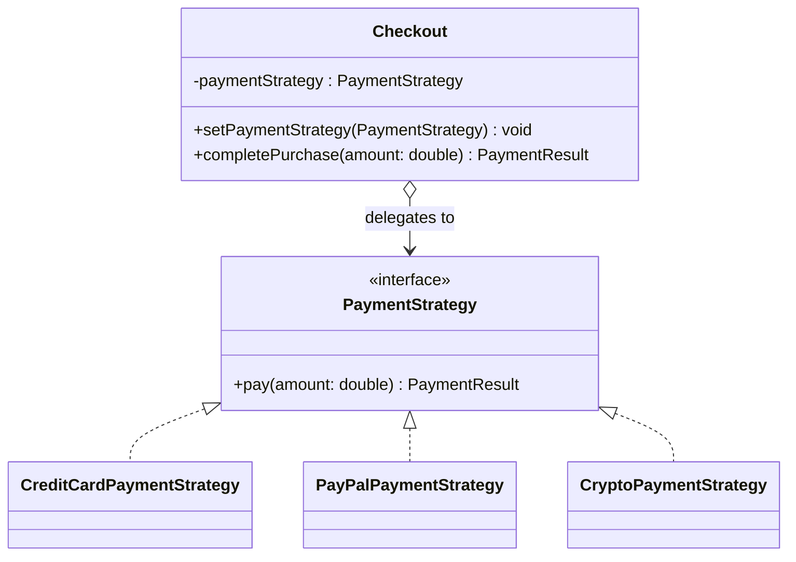
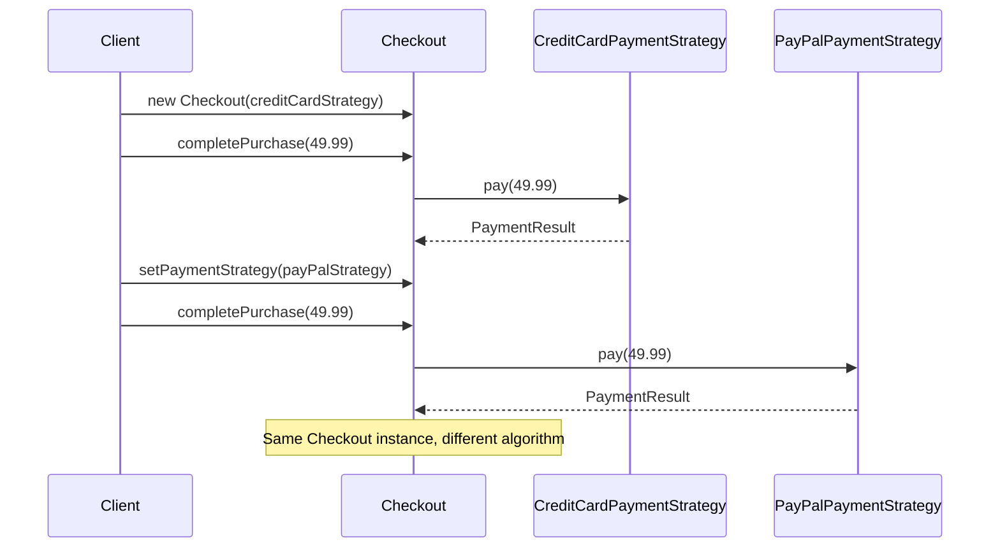

# 13 — Strategy

**Category:** Behavioral
**Difficulty:** ★★☆☆☆

## Intent

Define a family of interchangeable algorithms, encapsulate each one behind a common interface,
and let the object that uses them swap which one is active at runtime.

## Real-world analogy

Checking out at a store, you choose how to pay — card, PayPal, crypto — at the register, not when
the store was built. The register (the `Checkout`) doesn't know or care which payment method you
picked; it just calls `pay(amount)` on whatever you handed it. Swap the payment method and the
register's own code never changes.

## UML





## Participants

| Class | Role |
|---|---|
| `PaymentStrategy` | The Strategy interface — the interchangeable algorithm's contract |
| `CreditCardPaymentStrategy` / `PayPalPaymentStrategy` / `CryptoPaymentStrategy` | Concrete strategies |
| `Checkout` | The Context — holds a strategy reference and delegates to it |
| `spring/SpringCheckoutService` | Spring-flavored context that resolves a strategy from a `Map<String, PaymentStrategy>` |

## Why compose instead of subclass?

Before Strategy, varying an algorithm usually meant subclassing `Checkout` per payment method —
`CreditCardCheckout`, `PayPalCheckout`, and so on — duplicating everything about `Checkout` except
the one method that differs. Strategy pulls the varying part out into its own class hierarchy and
gives `Checkout` a reference to it instead. `Checkout` never grows a new subclass when a payment
method is added; only a new `PaymentStrategy` implementation is needed, and `Checkout` is
completely unaware it exists until it's plugged in.

## The Spring angle

`spring/SpringCheckoutService` takes a constructor parameter of type `Map<String,
PaymentStrategy>`. Spring auto-populates that map with every `PaymentStrategy` bean in the
context, keyed by bean name (`@Component("creditCard")`, `@Component("payPal")`,
`@Component("crypto")`) — this is a well-known Spring idiom for collecting an entire family of
beans by type. Looking a strategy up with `strategiesByName.get(key)` replaces a hand-written
if/else or switch statement that would otherwise have to know about every concrete strategy class;
the container does the strategy registration and lookup wiring for you, and adding a new strategy
is just adding a new `@Component` — `SpringCheckoutService` never changes.

## When to use

- An object needs one of several interchangeable algorithms, chosen at runtime (by config, user
  input, or request data).
- You want to eliminate conditional logic that branches on type to pick behavior.
- You want to unit test each algorithm variant in isolation from the object that uses it.

## When to avoid

- Only one implementation exists and none is realistically coming — the interface is pure
  ceremony.
- The "algorithm" is a single expression; a lambda/method reference (`Function<Double,
  PaymentResult>`) may be lighter weight than a full interface + classes.

## Run it

```bash
./gradlew :13-strategy:test
./gradlew :13-strategy:run
```

## Related patterns

- **State** (`18-state`) has an identical class shape — a context delegating to an interchangeable
  object — but State's objects also trigger transitions to *other* states; Strategy's don't know
  about one another at all.
- **Template Method** (`15-template-method`) varies *part* of an algorithm via inheritance;
  Strategy varies the *whole* algorithm via composition.
- **Factory Method** (`02-factory-method`) is often used to decide *which* strategy instance to
  construct in the first place.
