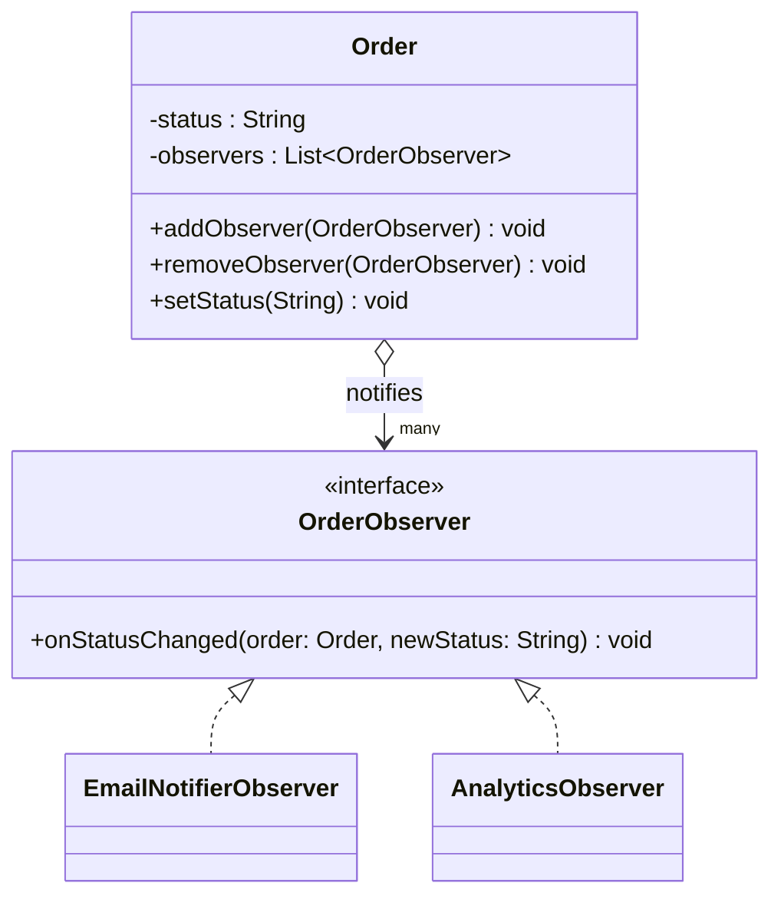
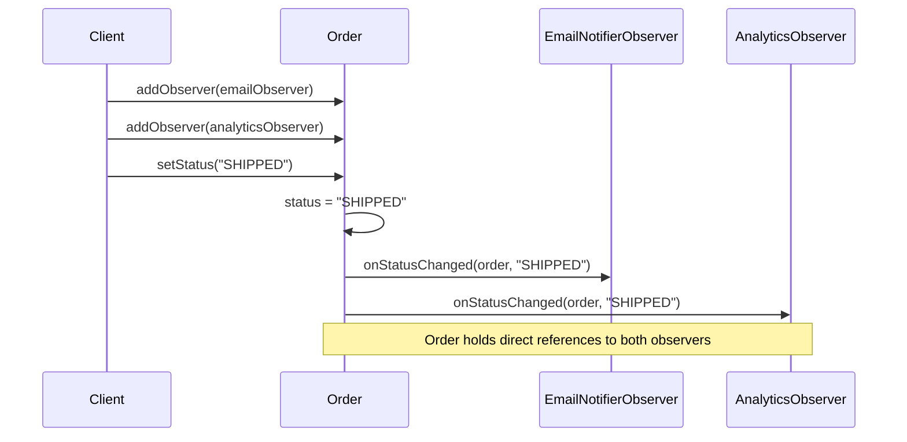

# 14 — Observer

**Category:** Behavioral
**Difficulty:** ★★★☆☆

## Intent

Define a one-to-many dependency between objects so that when one object (the Subject) changes
state, all its dependents (the Observers) are notified and updated automatically.

## Real-world analogy

Subscribing to a package's tracking notifications: the courier updates the shipment's status once,
and every subscriber — you, the sender, a delivery-app widget — gets pinged independently. The
courier doesn't know or care what any subscriber does with the update; it just broadcasts "status
changed" to whoever is listening.

## UML





## Participants

| Class | Role |
|---|---|
| `OrderObserver` | The Observer interface |
| `Order` | The Subject — holds observer references and pushes notifications |
| `EmailNotifierObserver` / `AnalyticsObserver` | Concrete observers |
| `spring/OrderStatusChangedEvent` | A Spring `ApplicationEvent` replacing the direct observer list |
| `spring/OrderService` | Publishes events instead of iterating observers directly |
| `spring/EmailEventListener` / `spring/AnalyticsEventListener` | `@EventListener` consumers |

## Push, not pull

`Order.setStatus` mutates its own state *first*, then calls every registered observer directly —
this is the "push" variant of the pattern: the subject hands observers the data they need
(`order`, `newStatus`) rather than making them come query it afterward. The cost of this design is
coupling: `Order` must hold a `List<OrderObserver>` and every observer must be registered on that
exact `Order` instance before it fires. That direct coupling is exactly what Spring's event
mechanism removes — see below.

## The Spring angle

`ApplicationEventPublisher` combined with `@EventListener` **is** the Observer pattern,
generalized and decoupled through the container:

- `spring/OrderService` depends only on `ApplicationEventPublisher` and calls
  `publisher.publishEvent(new OrderStatusChangedEvent(...))`. It has no list of listeners and no
  compile-time reference to `EmailEventListener` or `AnalyticsEventListener` at all.
- `spring/EmailEventListener` and `spring/AnalyticsEventListener` are `@Component`-annotated
  classes with an `@EventListener`-annotated method. They never register themselves on
  `OrderService` — the `ApplicationContext` scans for `@EventListener` methods and routes matching
  events to them automatically.

Compare that to plain `Order`: the Subject there must hold direct references to every Observer it
notifies (`observers.add(...)`), and an Observer must be handed a specific `Order` instance to
watch. With Spring, publisher and listener are connected only by the shared event type
(`OrderStatusChangedEvent`) — neither one imports or references the other, which is what makes the
container-based version decoupled where the hand-rolled version isn't.

## When to use

- Multiple parts of a system need to react to a state change without the subject knowing their
  concrete types in advance.
- You want to add or remove reactions without modifying the subject's code.
- In Spring apps specifically: cross-cutting side effects (auditing, notifications, cache
  invalidation) that shouldn't be tangled into the core service method that triggers them.

## When to avoid

- A direct method call is clearer when there's exactly one interested party and the coupling is
  intentional and permanent.
- Overusing broadcast events can make control flow hard to trace — "who handles this event?"
  becomes a project-wide search instead of a local one.

## Run it

```bash
./gradlew :14-observer:test
./gradlew :14-observer:run
```

## Related patterns

- **Strategy** (`13-strategy`) — a context delegating to one interchangeable object, vs. Observer
  notifying many.
- **Mediator** (`20-mediator`) centralizes communication between objects that would otherwise
  observe each other directly.
- **Chain of Responsibility** (`19-chain-of-responsibility`) passes a request along a line of
  candidate handlers instead of broadcasting to all of them at once.
