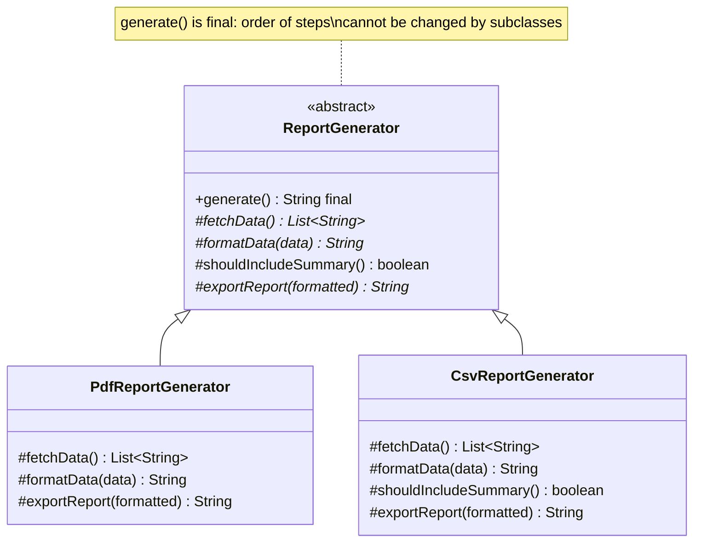
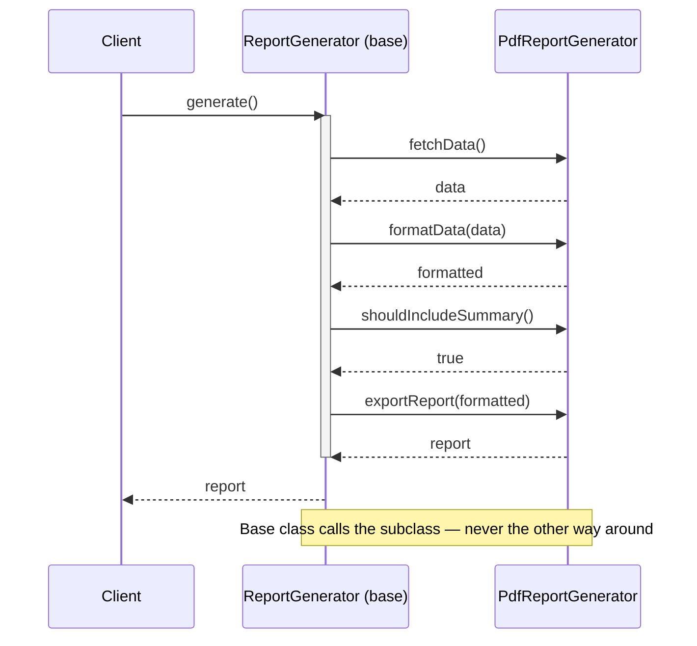

# 15 — Template Method

**Category:** Behavioral
**Difficulty:** ★★☆☆☆

## Intent

Define the skeleton of an algorithm in a base class method, deferring some of its steps to
subclasses. Subclasses can redefine specific steps of the algorithm without changing its overall
structure.

## Real-world analogy

A recipe card for "brew a hot drink": boil water, brew, pour into a cup, add condiments. Tea and
coffee both follow those exact four steps in that exact order — only "brew" and "add condiments"
differ between them. Nobody reorders the steps per drink; the recipe's structure is fixed, only
specific ingredients change.

## UML





## Participants

| Class | Role |
|---|---|
| `ReportGenerator` | Abstract base — owns the fixed `generate()` template method |
| `PdfReportGenerator` | Concrete subclass; uses the default summary hook |
| `CsvReportGenerator` | Concrete subclass; overrides the hook to skip the summary |

## The Hollywood Principle

"Don't call us, we'll call you." Subclasses of `ReportGenerator` never call `fetchData()`,
`formatData()`, or `exportReport()` themselves, and they never invoke `generate()` from within
their own code — the *base* class calls down into their overrides, at the points and in the order
*it* decides. `generate()` is `final` specifically to make this structural guarantee unbreakable:
no subclass can reorder fetch-then-format-then-export, skip a step, or call a step twice by
accident. Control flow lives in the base class; subclasses only ever supply the varying pieces
when asked.

`shouldIncludeSummary()` is a *hook*, distinct from the `abstract` steps: it has a sensible default
(`true`) and is *optionally* overridden, whereas `fetchData()`, `formatData()`, and
`exportReport()` have no default and must be implemented by every subclass. Hooks are how Template
Method lets subclasses opt into or out of optional behavior without making every subclass write
boilerplate for a step it doesn't care about.

## Template Method vs. Strategy

Both patterns let you vary behavior without touching the caller, but at different granularities and
through different mechanisms:

- **Template Method** varies *individual steps* of one fixed algorithm, through **inheritance** —
  `PdfReportGenerator` and `CsvReportGenerator` are both a `ReportGenerator`, sharing its
  `generate()` implementation completely.
- **Strategy** (`13-strategy`) varies the *entire* algorithm, through **composition** — a
  `Checkout` doesn't inherit from `CreditCardPaymentStrategy`, it holds a reference to one and
  could swap it for an entirely different object with a completely different implementation at
  runtime.

Rule of thumb: if only a couple of steps differ and the overall shape is genuinely shared, Template
Method keeps that shared shape in one place. If the "algorithm" is really a family of unrelated
implementations, Strategy avoids forcing them all into one inheritance hierarchy.

## When to use

- Multiple classes implement the same overall algorithm with only a few steps differing.
- You want to enforce a fixed sequence of operations while still allowing customization of
  specific parts.
- You're refactoring duplicated code across subclasses where only isolated steps actually differ.

## When to avoid

- The steps' order or presence genuinely needs to vary per case, not just their implementation —
  that's a sign you want Strategy or a plain pipeline of composable functions instead.
- Deep template-method hierarchies get hard to follow ("which class actually implements this
  step?") — prefer composition once the hierarchy gets more than one or two levels deep.

## Run it

```bash
./gradlew :15-template-method:test
./gradlew :15-template-method:run
```

## Related patterns

- **Strategy** (`13-strategy`) — see the comparison above; often confused with Template Method
  because both "vary an algorithm."
- **Factory Method** (`02-factory-method`) is frequently one of the abstract steps inside a
  template method — the base class calls an abstract "create the thing" step at a fixed point in
  its algorithm.
