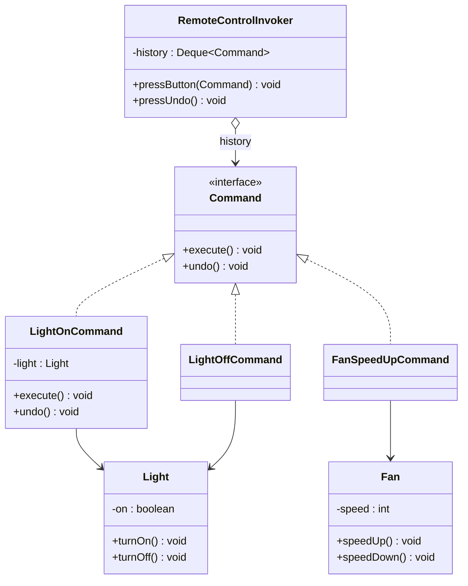
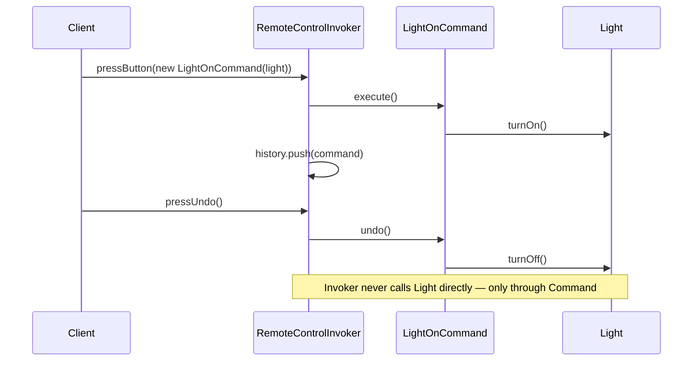

# 16 — Command

**Category:** Behavioral
**Difficulty:** ★★★☆☆

## Intent

Encapsulate a request as an object, so requests can be queued, logged, parameterized, and —
crucially here — undone, all without the invoker knowing anything about the receiver performing
the work.

## Real-world analogy

A restaurant order slip. The waiter (invoker) doesn't cook — they just write down "table 4: burger,
no onions" and hand the slip to the kitchen (receiver). The slip itself is a self-contained object:
it can be queued behind other slips, handed to whichever cook is free, or — if the kitchen keeps a
ticket log — used to figure out what to take back off the bill if the order is cancelled.

## UML





## Participants

| Class | Role |
|---|---|
| `Command` | The Command interface: `execute()` / `undo()` |
| `Light` / `Fan` | Receivers — do the real work, unaware any Command exists |
| `LightOnCommand` / `LightOffCommand` / `FanSpeedUpCommand` | Concrete commands binding a receiver to an action and its inverse |
| `RemoteControlInvoker` | The Invoker — triggers commands and keeps an undo history |

## Execute and undo as a matched pair

Each concrete command doesn't just wrap "do a thing" — it wraps "do a thing" *and* "undo that exact
thing," as two sides of the same object. `FanSpeedUpCommand.execute()` calls `fan.speedUp()`;
`FanSpeedUpCommand.undo()` calls `fan.speedDown()`. Because the inverse is a property of the
command, not something the invoker has to compute, `RemoteControlInvoker` can implement a fully
generic undo stack — `history.pop().undo()` — without a single `if` statement checking what kind of
command it's undoing.

`RemoteControlInvoker.pressUndo()` on an empty history is a defined no-op (checked explicitly
before popping) rather than an exception: pressing "undo" one time too many should be a completely
unremarkable user action, not a crash.

## When to use

- You need undo/redo, a request queue, request logging, or transactional rollback of a sequence of
  operations.
- You want to decouple the object that *invokes* an operation from the object that *performs* it —
  the invoker only needs to know the `Command` interface, never the receiver's API.
- You want to parameterize objects (e.g. UI buttons, menu items, macros) with an action to perform
  later.

## When to avoid

- A single, permanent, one-way action — wrapping a direct method call in a `Command` object adds a
  class and an interface for no undo/queue/log benefit.
- Undo requires more than reversing the last action's own effect (e.g. undo must account for other
  state that changed in between) — that calls for a snapshot-based approach like **Memento**
  instead of a purely reversible-step command.

## Run it

```bash
./gradlew :16-command:test
./gradlew :16-command:run
```

## Related patterns

- **Memento** (`21-memento`) is the alternative when undo needs a full state snapshot rather than a
  reversible step — use it when "undo" can't be expressed as "do the opposite operation."
- **Strategy** (`13-strategy`) also wraps behavior behind an interface, but Strategy has no notion
  of undo or history — it's about swapping *which* algorithm runs, not queuing/reversing actions.
- **Chain of Responsibility** (`19-chain-of-responsibility`) passes a request along a chain of
  candidate handlers instead of binding it to one fixed receiver up front.
