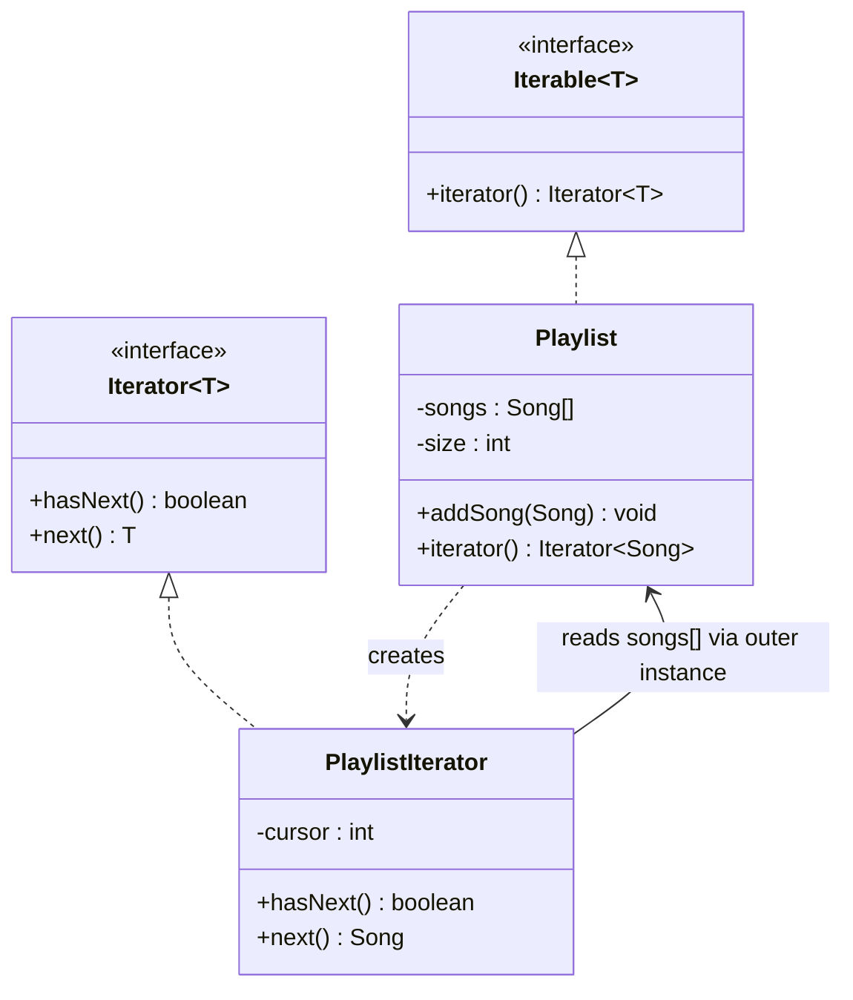
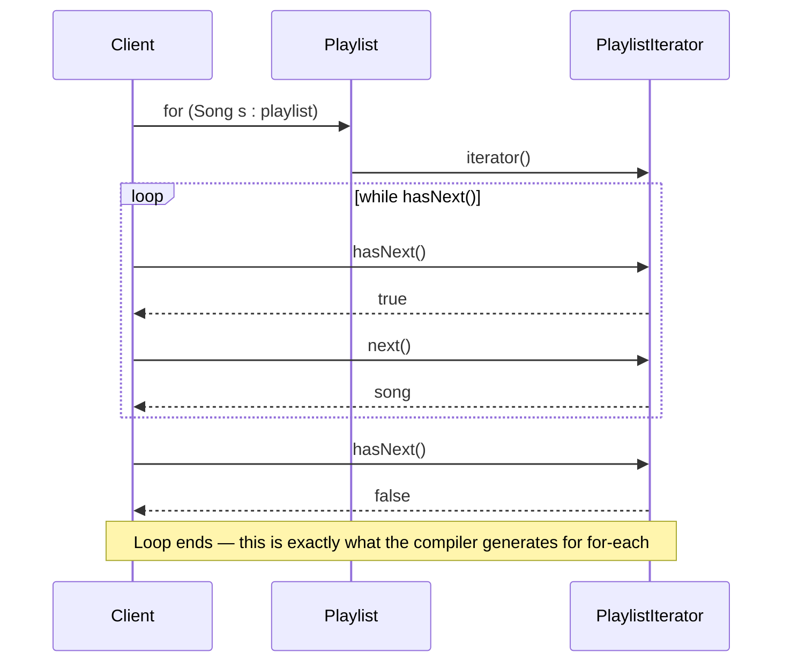

# 17 — Iterator

**Category:** Behavioral
**Difficulty:** ★★☆☆☆

## Intent

Provide a way to access the elements of an aggregate object sequentially without exposing its
underlying representation (array, linked list, tree, hash table...).

## Real-world analogy

A museum audio guide. You press "next" and hear about the next exhibit, in order, without needing
to know whether the museum's floor plan is a grid, a spiral, or a maze behind the scenes. The guide
exposes exactly one operation — "give me the next thing" — and hides everything about how exhibits
are actually laid out and stored.

## UML





## Participants

| Class | Role |
|---|---|
| `Song` | The element type being iterated |
| `Playlist` | The Aggregate — implements `Iterable<Song>`, owns the private backing storage |
| `PlaylistIterator` | The Iterator — a private inner class walking `Playlist`'s array by index |

## It's already in the language

`java.util.Iterator` and `java.util.Iterable` **are** the GoF Iterator pattern, built directly into
Java's syntax — arguably the most invisible-because-it's-everywhere pattern in this whole repo.
Every time you write:

```java
for (Song song : playlist) { ... }
```

the compiler desugars that to exactly the `hasNext()`/`next()` loop `PlaylistDemo` shows explicitly
side by side with the for-each version:

```java
Iterator<Song> it = playlist.iterator();
while (it.hasNext()) {
    Song song = it.next();
    ...
}
```

`ArrayList`, `HashSet`, `TreeMap.values()`, NIO's `DirectoryStream` — anything usable in a for-each
loop implements `Iterable` and hands out an `Iterator` exactly like `Playlist` does here. This
module deliberately backs `Playlist` with a raw `Song[]` array (grown manually, not
`ArrayList.iterator()` wrapped) so `PlaylistIterator.next()` has to track its own cursor and raise
`NoSuchElementException` itself — the mechanics a built-in collection normally hides from you.

## When to use

- You're building a custom collection type and want it to work with for-each, streams, and any API
  expecting `Iterable`.
- You want to hide *how* elements are stored (array vs. linked structure vs. computed on the fly)
  from code that only needs to walk them in order.
- You want multiple independent traversals of the same aggregate happening at once — each call to
  `iterator()` here returns a fresh cursor.

## When to avoid

- If a `List`/`Set`/`Map` already models your data well, use it directly — implementing `Iterable`
  yourself only pays off when your storage genuinely isn't one of the standard collections.
- Exposing indexed random access (`get(int)`) may be simpler and sufficient if callers never
  actually need forward-only traversal semantics.

## Run it

```bash
./gradlew :17-iterator:test
./gradlew :17-iterator:run
```

## Related patterns

- **Composite** (`09-composite`) structures are frequently traversed with a custom `Iterator` that
  hides whether a node is a leaf or a branch.
- **Visitor** (`22-visitor`) is an alternative way to act on every element of a structure —
  Iterator pulls elements one at a time from outside, Visitor pushes an operation into the
  structure itself.
