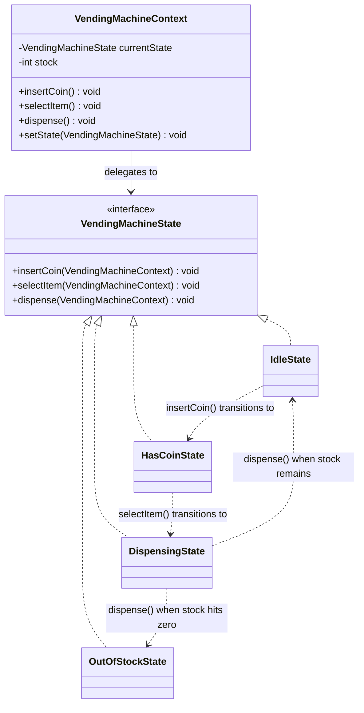
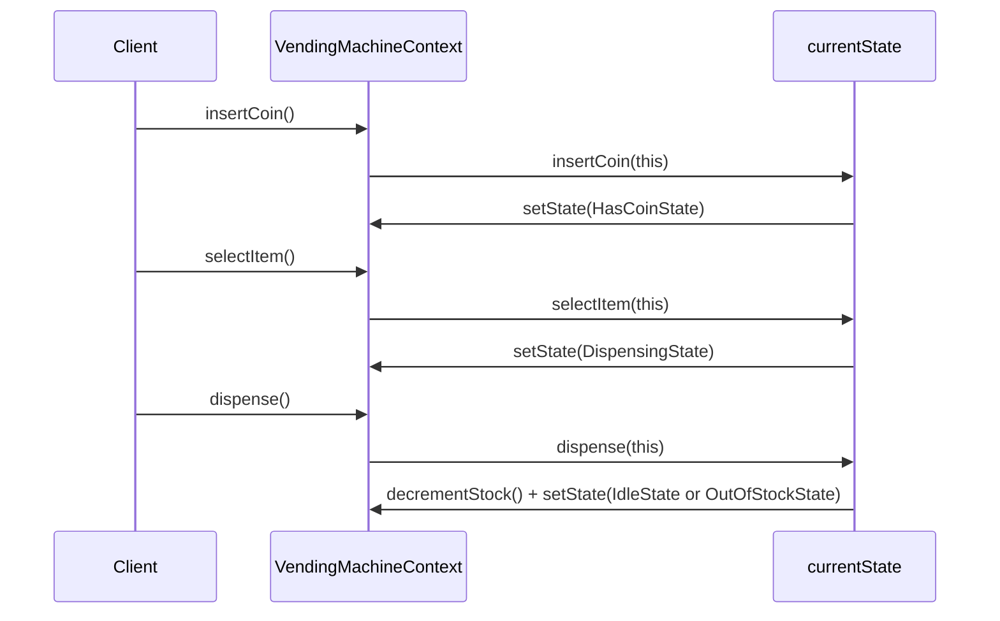

# 18 — State

**Category:** Behavioral
**Difficulty:** ★★★☆☆

## Intent

Let an object alter its behavior when its internal state changes, so it appears to change class.
Each state's behavior lives in its own class instead of being scattered across `if`/`switch`
statements inside the object it belongs to.

## Real-world analogy

A vending machine physically behaves differently depending on what has already happened: before
you pay, pressing a selection button does nothing; after you pay, it accepts a selection; while it
is mechanically dropping an item, it ignores both coins and buttons. The machine doesn't consult a
mental checklist for every button press — each phase simply *is* a different mode of operation
with its own rules.

## UML





## Participants

| Class | Role |
|---|---|
| `VendingMachineState` | State interface; default methods reject actions that are invalid unless overridden |
| `VendingMachineContext` | Holds the current state and forwards every call to it |
| `IdleState` | Waiting for a coin |
| `HasCoinState` | Coin accepted, waiting for a selection |
| `DispensingState` | Actively releasing an item; decides the next state based on remaining stock |
| `OutOfStockState` | Nothing left to sell; every action is rejected |

## State vs. a status field and a switch statement

The alternative most people reach for first is a `VendingMachineStatus` enum plus a `switch` at the
top of every method:

```java
switch (status) {
    case IDLE -> { ... }
    case HAS_COIN -> { ... }
    case DISPENSING -> { ... }
    case OUT_OF_STOCK -> { ... }
}
```

That `switch` has to be repeated in `insertCoin()`, `selectItem()`, and `dispense()` — three
copies of the same five-way branch, all of which must be kept in sync by hand. Add a fifth state
(say, `MAINTENANCE`) and you must find and edit every one of those switches, in every method,
without missing one; the compiler will not tell you if you forget a branch in a `switch` that has a
`default`.

The State pattern inverts this: each **state** is a class that knows its own legal transitions.
`VendingMachineContext` never asks "what state am I in?" — it just calls `currentState.selectItem
(this)` and lets that state object decide what happens, including transitioning itself via
`setState(...)`. Adding `MaintenanceState` means writing one new class; the context and every
existing state class are untouched.

## When to use

- An object's behavior depends on its state, and it must change behavior at runtime as that state
  changes.
- You have large conditional statements whose branches depend on the object's current state, and
  those branches are duplicated across several methods.

## When to avoid

- Only one or two methods actually branch on state, and there is no real prospect of adding more
  states — a plain `if`/enum is simpler and easier to read in one place.
- The states rarely change or the transitions are trivial; the extra classes add indirection for
  no real payoff.

## Run it

```bash
./gradlew :18-state:test
./gradlew :18-state:run
```

## Related patterns

- **Strategy** (`13-strategy`) has an almost identical class shape (context + interchangeable
  interface implementations), but the strategy is chosen by the *client* and doesn't change itself;
  states transition *themselves* in response to events.
- **Command** (`16-command`) is sometimes used alongside State to encapsulate the actions that
  trigger transitions.
