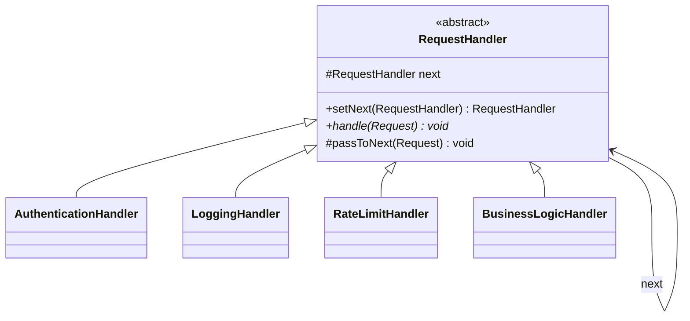
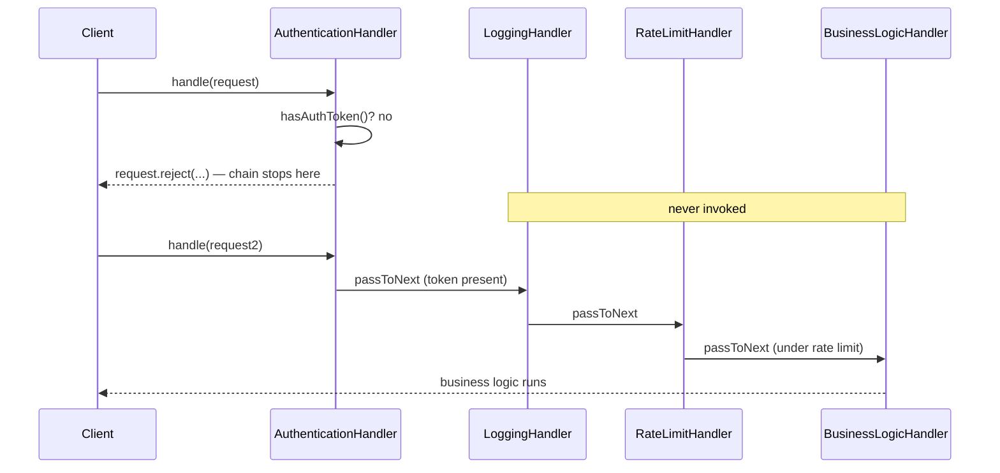

# 19 — Chain of Responsibility

**Category:** Behavioral
**Difficulty:** ★★★☆☆

## Intent

Avoid coupling the sender of a request to its receiver by giving more than one object a chance to
handle the request. Chain the receiving objects and pass the request along the chain until
something handles it (or the chain declines it).

## Real-world analogy

An expense report at a company routes through a chain of approvers: your manager, then their
director, then finance, depending on the amount. Each approver either signs off and passes it
along, or rejects it outright and the report goes no further. Nobody at the start of the chain
needs to know how many approvers exist after them, or what they do.

## UML





## Participants

| Class | Role |
|---|---|
| `RequestHandler` | Abstract link: holds the `next` reference and the `setNext`/`passToNext` plumbing |
| `AuthenticationHandler` | Rejects requests with no auth token; short-circuits on failure |
| `LoggingHandler` | Observes every request, never short-circuits |
| `RateLimitHandler` | Rejects a client once it exceeds a per-instance request threshold |
| `BusinessLogicHandler` | Terminal handler — reaching it means the request passed everything before it |
| `Request` | The object threaded through the chain, carrying its own visited/rejected state |

## This is literally how servlet filters work

`RequestHandler.handle(Request)` calling `passToNext(request)` (or not) is structurally identical
to a `javax.servlet.Filter.doFilter(request, response, chain)` calling `chain.doFilter(...)` (or
not), and to Spring's `HandlerInterceptor.preHandle(...)` returning `false` to stop a request
before it reaches the controller. This module has **no** servlet or Spring dependency — it is
plain Java — precisely so the shape of the pattern is visible without a framework's machinery
around it. Once you've built `AuthenticationHandler`/`LoggingHandler` by hand here, a
`FilterChain` of `Filter`s (or a stack of `HandlerInterceptor`s) is the same idea with a
container calling `setNext` for you.

## When to use

- Multiple objects might handle a request, and the handler isn't known in advance — it's decided
  at runtime by walking the chain.
- You want to issue a request without specifying the receiver explicitly (decoupling sender from
  receiver).
- Cross-cutting concerns (auth, logging, rate limiting) need to run before a "real" handler, and
  any one of them should be able to stop the request early.

## When to avoid

- The set of handlers and their order is fixed and small — a straight-line sequence of method
  calls is more debuggable than a chain you have to step through to see what ran.
- Every request must always reach a specific handler — Chain of Responsibility makes "who handled
  this, and did anyone?" implicit, which is a liability if that must always be certain.

## Run it

```bash
./gradlew :19-chain-of-responsibility:test
./gradlew :19-chain-of-responsibility:run
```

## Related patterns

- **Decorator** (`07-decorator`) has a similar "wrap and forward" shape, but every decorator is
  expected to eventually call through; Chain of Responsibility handlers are expected to sometimes
  *not* forward.
- **Command** (`16-command`) is often what a terminal handler in the chain ends up invoking.
- **Composite** (`09-composite`) also forwards calls along a structure, but through a tree of
  parts-and-wholes rather than a linear sequence of candidate handlers.
