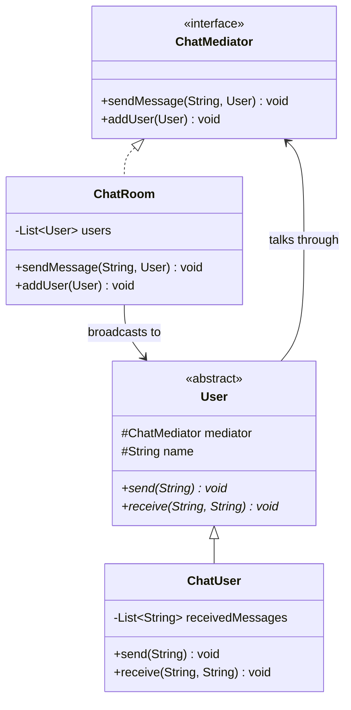
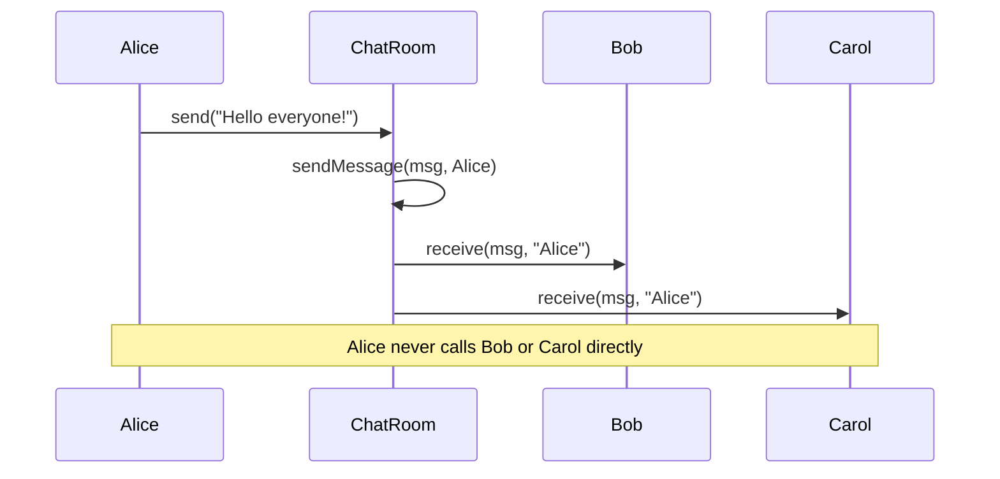

# 20 — Mediator

**Category:** Behavioral
**Difficulty:** ★★★☆☆

## Intent

Define an object that encapsulates how a set of objects interact, so those objects don't refer to
each other directly, and their interactions can vary independently.

## Real-world analogy

An air traffic controller talks to every plane in their sector; planes never coordinate directly
with each other. A pilot doesn't need a radio frequency for every other plane in the sky — just
one, to the tower. The tower decides who talks to whom and when.

## UML





## Participants

| Class | Role |
|---|---|
| `ChatMediator` | Mediator interface: routes messages and tracks participants |
| `ChatRoom` | Concrete mediator; the only object that holds references to every user |
| `User` | Abstract colleague; holds a reference to the mediator only |
| `ChatUser` | Concrete colleague; records what it receives, for observation |

## Star topology instead of a fully-connected graph

Without a mediator, N chat users who all need to message each other directly require each user to
hold a reference to every other user — N*(N-1) references total, and every new user means editing
every existing user to introduce it. Removing a user means finding and cleaning up every reference
to it scattered across the others.

`ChatMediator` collapses that fully-connected graph into a star: each `User` holds exactly **one**
reference (to the mediator), and `ChatRoom` holds the references to everyone. Adding a fourth,
fifth, or fiftieth user means calling `room.addUser(...)` once — no existing `User` is touched,
because no `User` ever knew about any other `User` in the first place. The coordination logic
(who receives what, in what order, with what filtering) also now lives in exactly one place — the
mediator — instead of being duplicated inside every participant.

## When to use

- A set of objects communicate in well-defined but complex ways, and those interactions would
  otherwise create a tangle of direct references between them.
- You want to reuse a colleague object (a `User`) in a different mediator (a different `ChatRoom`)
  without dragging along references to its old collaborators.

## When to avoid

- Only two objects interact — a mediator adds a layer of indirection with nothing to coordinate.
- The mediator itself starts absorbing so much logic that it becomes a god object; if `ChatRoom`
  starts doing message parsing, persistence, and business rules, consider splitting the
  coordination responsibilities back out.

## Run it

```bash
./gradlew :20-mediator:test
./gradlew :20-mediator:run
```

## Related patterns

- **Observer** (`14-observer`) also decouples senders from receivers, but there the subject
  broadcasts to observers with a fixed one-directional protocol; Mediator coordinates
  many-directional interactions between peers of the same kind.
- **Facade** (`08-facade`) simplifies a one-way call *into* a subsystem; Mediator coordinates
  *between* peers that would otherwise talk directly to each other.
