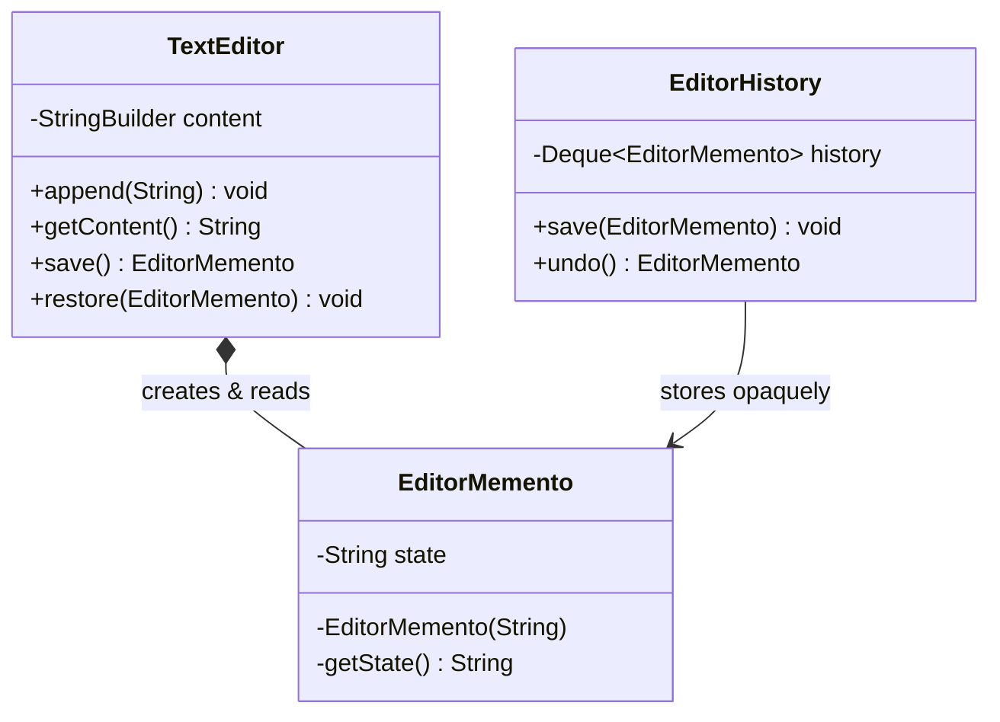
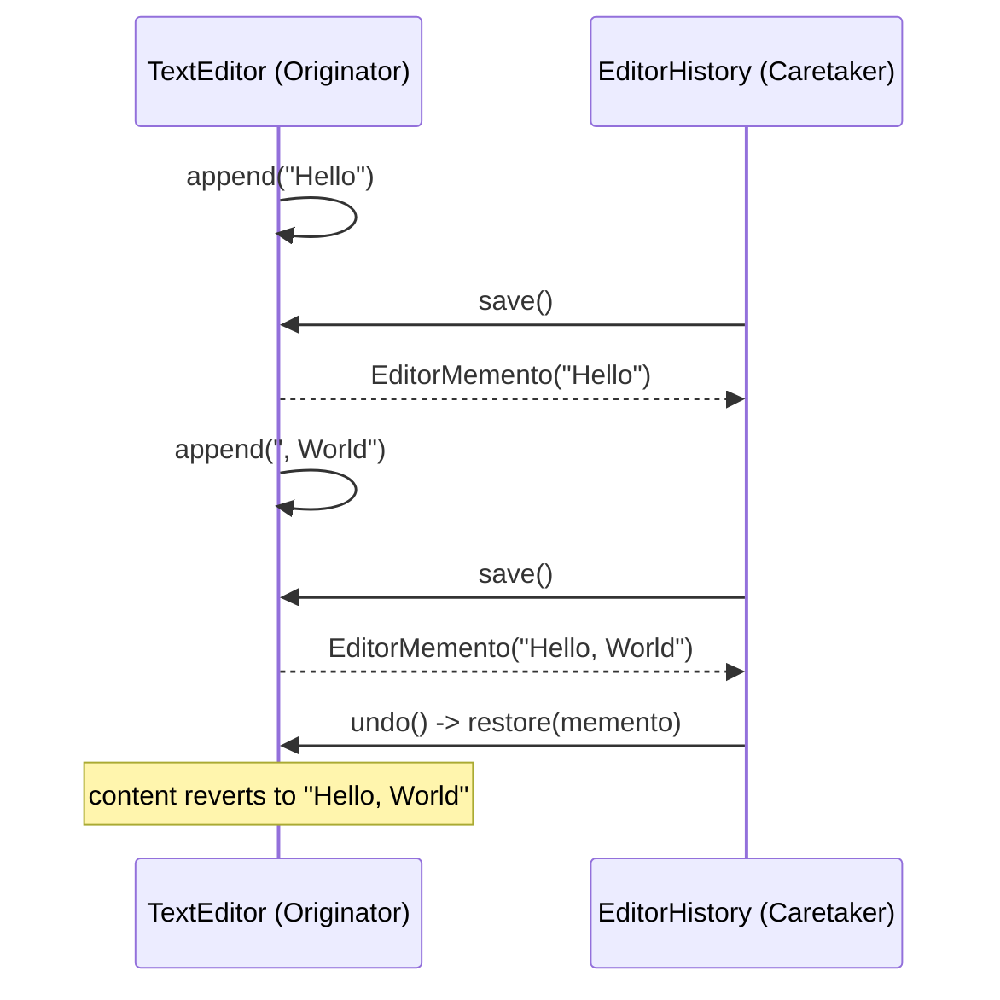

# 21 — Memento

**Category:** Behavioral
**Difficulty:** ★★★☆☆

## Intent

Without violating encapsulation, capture and externalize an object's internal state so it can be
restored to that state later.

## Real-world analogy

A video game "save point" captures everything about your progress into a save file. You don't
need to know the internal layout of that file to load it back later — you just hand it to the
game and it restores you to exactly where you were. Crucially, the save file itself doesn't let
anyone poke at or edit your stats directly; only the game engine that produced it knows how to
read it back.

## UML





## Participants

| Class | Role |
|---|---|
| `TextEditor` | Originator — owns the real state and knows how to snapshot/restore it |
| `TextEditor.EditorMemento` | Opaque snapshot; private constructor and accessor, readable only by `TextEditor` |
| `EditorHistory` | Caretaker — stores mementos on a stack, never looks inside them |

## Encapsulation without a public getter

The whole trick is in `EditorMemento` being a **static nested class of `TextEditor`** with a
private constructor and a private `getState()`. Java grants an enclosing class access to its
nested class's private members (via synthetic accessors the compiler generates), so `TextEditor`
can freely create and read mementos — but `EditorHistory`, a completely different class, can only
ever hold a reference of type `EditorMemento` and pass it back; it has no method available to read
what's inside. This is different from just making the field `public final` or adding a public
getter: either of those would let *any* code reconstruct or inspect the editor's past content,
which defeats the purpose of a snapshot being tied to its originator.

## When to use

- You need undo/redo, checkpoints, or rollback, and computing the *inverse* of an operation (as
  Command-based undo does) is impractical or the state is too complex to reverse-engineer.
- You want to snapshot an object's state without exposing its internal representation to the code
  that stores the snapshots.

## When to avoid

- State is large or snapshots are frequent — storing full copies can be expensive; consider
  storing deltas instead, or bounding history size.
- The "undo" is really just a small number of well-defined inverse operations — Command's
  reverse-operation approach can be cheaper and doesn't require copying full state.

## Run it

```bash
./gradlew :21-memento:test
./gradlew :21-memento:run
```

## Related patterns

- **Command** (`16-command`) is the *other* way to implement undo: each command knows how to
  reverse itself, rather than the originator producing full-state snapshots. Memento trades extra
  memory (whole-state copies) for not having to write an inverse for every operation; Command
  trades that memory cost for the burden of writing (and keeping correct) an `undo()` per command.
  Pick Memento when state is small/cheap to copy or operations are hard to invert; pick Command
  when operations are naturally invertible and state is large.
- **Iterator** (`17-iterator`) mementos are sometimes used together to snapshot iteration
  position.
