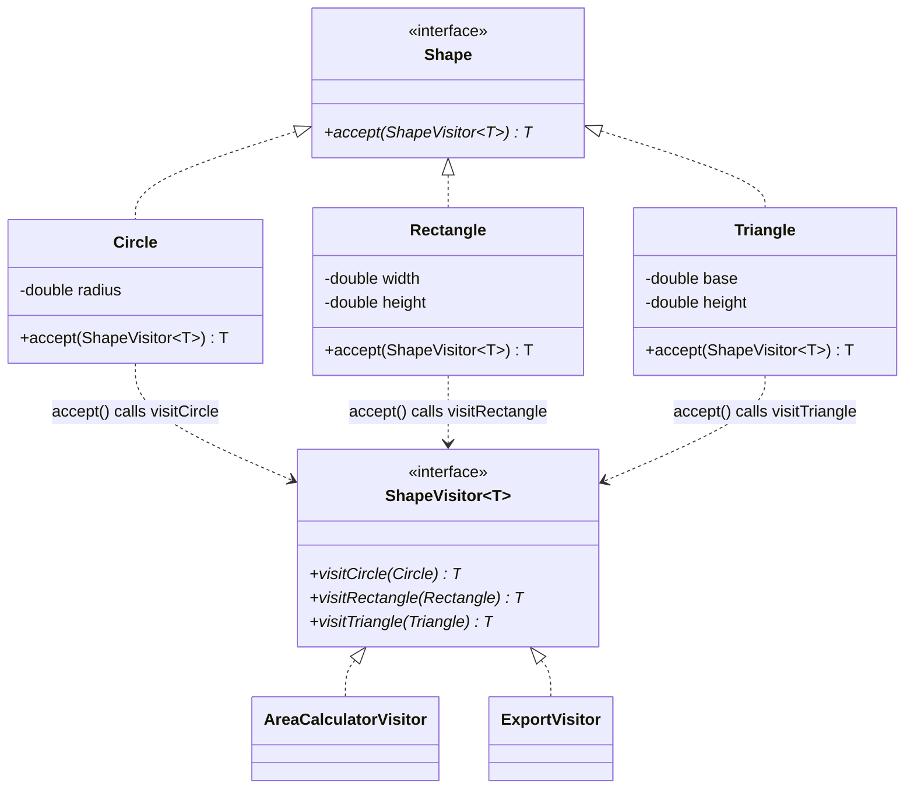
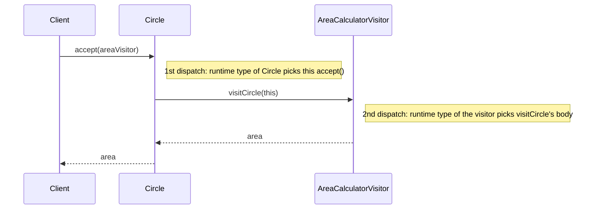

# 22 — Visitor

**Category:** Behavioral
**Difficulty:** ★★★★☆

## Intent

Represent an operation to be performed on the elements of an object structure, without changing
the classes of the elements it operates on. New operations can be added by writing a new visitor
class rather than editing every element class.

## Real-world analogy

A tax auditor visits many different kinds of businesses — restaurants, retailers, freelancers —
each with different bookkeeping. The auditor (the visitor) knows how to handle each business type,
but the businesses themselves don't need to know anything about tax auditing; they just let the
auditor in and answer their questions. A building inspector could "visit" the same businesses for
a completely different purpose (safety, not taxes) without the businesses changing at all.

## UML





## Participants

| Class | Role |
|---|---|
| `Shape` | Element interface — the single `accept` method is the only visitor-related code on it |
| `Circle`, `Rectangle`, `Triangle` | Concrete elements; each `accept` calls the matching `visitXxx` |
| `ShapeVisitor<T>` | Visitor interface, one method per concrete shape |
| `AreaCalculatorVisitor` | Concrete visitor: computes area, returns `Double` |
| `ExportVisitor` | Concrete visitor: builds a description string, returns `String` |

## Double dispatch, precisely

Java method overloading resolves on **compile-time** static types, so a single call like
`shape.operate(visitor)` can never pick different code based on `shape`'s *runtime* type alone —
that's why Visitor needs two calls, not one. The mechanism:

1. `shape.accept(visitor)` — a normal **virtual method call**. The JVM dispatches to whichever
   `accept` override belongs to `shape`'s actual runtime class (`Circle`, `Rectangle`, or
   `Triangle`). This is dispatch #1, on the *element's* type.
2. Inside that `accept`, the concrete class calls a **specific, statically-known** method on the
   visitor — `Circle.accept` always calls `visitor.visitCircle(this)`, never
   `visitRectangle`. That call is itself virtual on `visitor`'s runtime type, so which
   `ShapeVisitor` implementation's `visitCircle` body actually runs depends on whether `visitor` is
   an `AreaCalculatorVisitor` or an `ExportVisitor`. This is dispatch #2, on the *operation's* type.

Both the shape's type and the visitor's type jointly determine what code executes — that's "double
dispatch". Neither a single virtual call nor overloading alone can express this; it requires the
`accept`/`visitXxx` round-trip.

## The tradeoff, stated exactly

- **Adding a new operation** (e.g. a `SerializeVisitor` or `PerimeterCalculatorVisitor`): write one
  new class implementing `ShapeVisitor<T>`. **Zero changes** to `Shape`, `Circle`, `Rectangle`, or
  `Triangle`.
- **Adding a new shape** (e.g. `Square`): `Square` must implement `Shape.accept`, AND every
  existing `ShapeVisitor<T>` implementation (`AreaCalculatorVisitor`, `ExportVisitor`, and any
  future ones) must gain a `visitSquare` method, because `ShapeVisitor<T>` is an interface with one
  method per shape. **This is a real, unavoidable cost.**

This is the exact inverse of putting `getArea()`/`export()` methods directly on `Shape`: with
methods-on-the-hierarchy, adding a shape is cheap (implement the interface once) but adding an
operation means touching every shape class. Visitor is the right tool specifically when your
object structure (the shapes) is stable and operations on it grow over time — not the reverse.

## When to use

- The class hierarchy is stable, but you need to add new, unrelated operations over it regularly,
  and don't want to keep editing every element class.
- The operations don't belong conceptually on the elements themselves (export formats, tax rules,
  rendering backends) and putting them there would bloat the domain classes.

## When to avoid

- New element subtypes are added often and operations are stable — Visitor forces you to edit
  every visitor for every new element, which is the more painful direction here.
- The object structure is small and simple; a couple of `instanceof` checks or methods directly on
  the classes are easier to follow than the accept/visit indirection.

## Run it

```bash
./gradlew :22-visitor:test
./gradlew :22-visitor:run
```

## Related patterns

- **Iterator** (`17-iterator`) is often combined with Visitor to walk a structure while visiting
  each element.
- **Composite** (`09-composite`) structures are a very common target for Visitor, since visiting a
  tree of parts-and-wholes is where "add an operation without touching every node class" pays off
  most.
- **Strategy** (`13-strategy`) also swaps in behavior via an interface, but Strategy picks *one*
  algorithm for a single context; Visitor applies one operation across a whole *hierarchy* of
  different element types via double dispatch.
