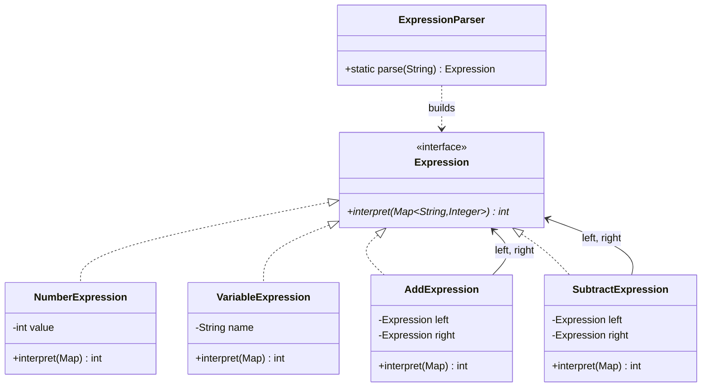
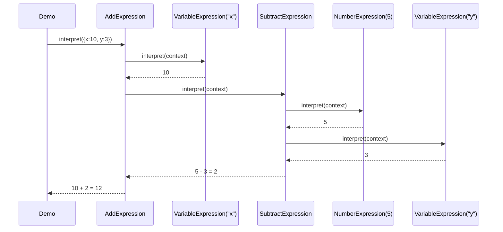

# 23 — Interpreter

**Category:** Behavioral
**Difficulty:** ★★★★★ (hardest module in the curriculum — final behavioral pattern)

## Intent

Given a language, define a representation for its grammar along with an interpreter that uses the
representation to evaluate sentences in that language. Each grammar rule becomes a class; a
sentence in the language becomes a tree of those classes; evaluating the sentence means walking
the tree.

## Real-world analogy

A basic calculator app parses what you type — `"x + 5 - y"` — into an internal structure before it
can compute anything. It isn't scanning the raw string every time you press `=`; it builds a small
tree representing "add these two things", where one of those things is itself "subtract these two
things", and evaluating the tree bottom-up gives the answer. That tree-of-tiny-rules structure,
where each piece knows how to evaluate only itself and delegates the rest, is exactly what
Interpreter formalizes.

## UML





## Participants

| Class | Role |
|---|---|
| `Expression` | The shared grammar-rule interface: `interpret(context)` |
| `NumberExpression` | Terminal expression — a literal integer |
| `VariableExpression` | Terminal expression — looks a name up in the context, throws if undefined |
| `AddExpression` | Non-terminal expression — combines `left`/`right` with `+` |
| `SubtractExpression` | Non-terminal expression — combines `left`/`right` with `-` |
| `ExpressionParser` | Minimal string-to-tree builder for a space-separated infix expression |

## Why this is the capstone-adjacent module

This pattern is genuinely **rarely hand-rolled in production systems today**. If a real project
needs to evaluate expressions, the pragmatic choices are: a regular expression for something
simple, a generated parser from a grammar (ANTLR, or a hand-written recursive-descent parser for
anything nontrivial), or embedding an existing expression/scripting language (Spring's SpEL, MVEL,
JavaScript via GraalVM, etc.) rather than inventing a new one. Writing your own `Expression` tree
by hand doesn't scale past toy grammars — every new operator or precedence rule means a new class
and re-deriving how the parser folds tokens.

So why learn it? Because **this is how those tools work internally.** SpEL, ANTLR-generated
parsers, and every hand-written recursive-descent parser build the same shape under the hood: a
tree of small objects, each responsible for interpreting only its own piece of the grammar,
composed out of smaller pieces the same way. `AddExpression` holding `left`/`right` `Expression`
references *is* an AST (abstract syntax tree) node — the vocabulary changes in "real" parsers
(`Node`, `AstNode`, `Visitor` over the tree) but the recursive structure is identical. This module
is deliberately the bridge into the recursive-descent-parser style you'll see used for real,
"system"-shaped purposes in the `24`–`27` capstone modules.

## The parser is intentionally tiny

`ExpressionParser.parse` only handles single-character `+`/`-` tokens separated by whitespace, with
no operator precedence to resolve (there's only one precedence level) and no parentheses. It works
by folding left-to-right: read the first operand, then repeatedly read an operator and the next
operand, building the tree bottom-up as it goes. That's sufficient to turn `"x + 5 - y"` into a
real `Expression` tree — but notice it makes no attempt at tokenizing numbers with multiple digits
robustly, handling negative literals, or supporting `*`/`/` with correct precedence. A grammar with
more than one precedence level needs a proper recursive-descent parser (or a parser generator);
this one is deliberately just enough to make "interpreter" feel real without becoming a full
compiler-front-end exercise.

## When to use

- You have a small, stable, well-defined grammar (a query language, a rule engine's condition
  syntax, a simple formula language) and want a straightforward, extensible way to represent and
  evaluate it.
- Efficiency of the *interpreter itself* is not the primary constraint — a tree-walking
  interpreter is simple to write and reason about, but slower than a compiled or bytecode
  approach.

## When to avoid

- The grammar is anything beyond trivial (operator precedence, parentheses, function calls) — use
  a proper parser generator (ANTLR) or an existing embeddable expression language instead of
  growing this by hand.
- Performance matters — tree-walking interpreters re-traverse the same structure on every
  evaluation; a real system would compile the expression to bytecode or a closure once, then
  execute the compiled form repeatedly.

## Run it

```bash
./gradlew :23-interpreter:test
./gradlew :23-interpreter:run
```

## Related patterns

- **Composite** (`09-composite`) — an `Expression` tree *is* a Composite structure; Interpreter is
  really "Composite plus an `interpret` method with grammar semantics attached to each node type."
- **Visitor** (`22-visitor`) is a common companion once the tree grows: instead of hard-coding
  `interpret` on every node, a `ExpressionVisitor<T>` can add new operations (pretty-printing,
  optimization passes, type-checking) without touching the `Expression` classes — the same
  tradeoff explored in `22-visitor`, applied to an AST.
- **Command** (`16-command`) — both wrap a piece of behavior in an object, but Command encapsulates
  a single action to be executed once; Interpreter's expression tree is composed recursively to
  represent an entire grammar.
