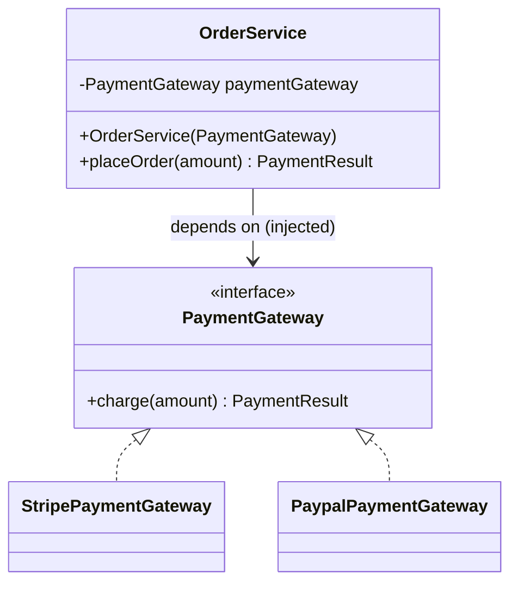
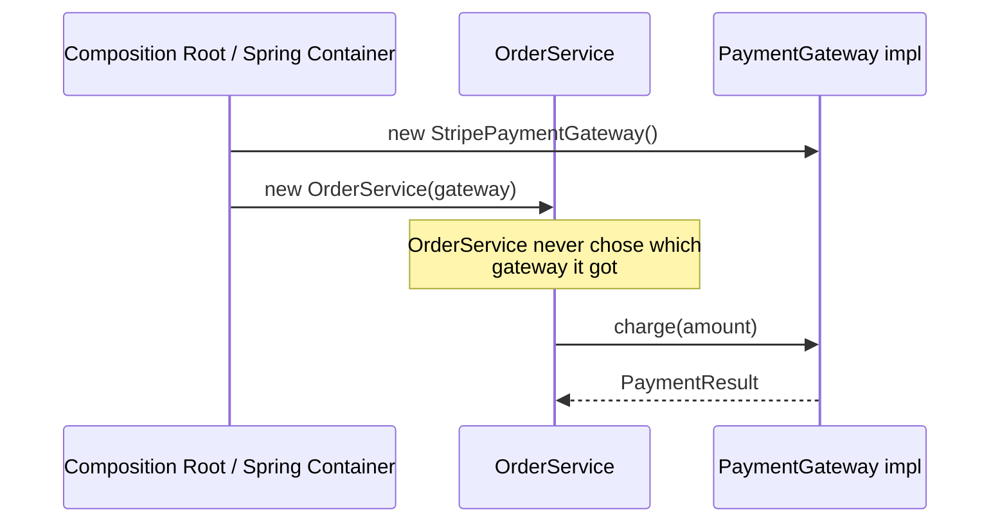

# 24 — Dependency Injection & Inversion of Control

**Category:** Capstone (Enterprise / Spring)
**Difficulty:** ★★★★☆

## Intent

Don't let an object construct or look up its own dependencies — hand them in from outside. The
object declares *what* it needs (usually via constructor parameters); something else — a
composition root, or a DI container — decides *which concrete implementation* to provide.

## Real-world analogy

A restaurant kitchen doesn't send the chef out to a farm to grow vegetables. Ingredients are
delivered to the kitchen; the chef's job is only to cook with whatever arrives. Swap the supplier
and the chef's recipe doesn't change — the chef depends on "vegetables arrive," not on any
specific farm.

## UML





## Participants

| Class | Role |
|---|---|
| `PaymentGateway` | The abstraction consumers depend on |
| `OrderService` | Consumer — receives its dependency via constructor, never constructs it |
| `ManualDIDemo` | Hand-wired composition root ("poor man's DI") |
| `spring/DiConfig` | Spring `@Configuration` wiring the same plain classes through the container |
| `spring/AuditLogger` | Demonstrates container-managed bean lifecycle (`@PostConstruct`/`@PreDestroy`) |

## Why this is the capstone, not just another pattern

This module deliberately reuses the exact plain classes (`PaymentGateway`, `StripePaymentGateway`,
`OrderService`) in two demos:

1. **`ManualDIDemo`** — no framework. One method, close to `main`, wires concrete classes by hand
   into a `new OrderService(new StripePaymentGateway())`. This *is* dependency injection — DI is a
   principle, not a framework feature. It's just manual and doesn't scale past a handful of
   objects.
2. **`spring/DiConfig`** — the same plain classes, now assembled by a Spring
   `AnnotationConfigApplicationContext`. Notice `PaymentGateway`, `StripePaymentGateway`, and
   `OrderService` carry **zero** Spring annotations — only `DiConfig` (the composition root, now
   automated) knows about the framework. This keeps the domain model portable and trivially
   testable outside a container (see `OrderServiceTest`, which injects a lambda as a test double
   with no Spring involved at all).

`spring/AuditLogger` demonstrates the other half of what a container gives you beyond wiring:
**lifecycle management**. `@PostConstruct` fires once the bean's dependencies are set;
`@PreDestroy` fires when the container closes — `DiConfigTest` asserts the exact event order.

### The thread running through this whole repo

Every module tagged "(Spring)" earlier in the curriculum is this same container doing pattern
work you'd otherwise hand-write:

- **01-singleton** — `@Bean` methods are singleton-scoped by default: the container *is* your
  singleton registry.
- **10-proxy** — Spring AOP's `ProxyFactory` generates a proxy object for you instead of you
  hand-writing `ProxyImage`.
- **13-strategy** — `Map<String, PaymentStrategy>` injection lets the container assemble the
  strategy registry instead of a hand-written `switch`.
- **14-observer** — `ApplicationEventPublisher`/`@EventListener` decouples publishers from
  listeners entirely, both wired through the same container.

Dependency Injection is the mechanism underneath all of those: a container that constructs objects
and hands them their dependencies, so application code can depend on abstractions and never call
`new` on a concrete collaborator.

## When to use

- Any object with a collaborator that might reasonably be swapped (implementation, mock in tests,
  different config per environment).
- Whenever you want to unit test a class without also standing up its real dependencies.

## When to avoid

- Trivial scripts/utilities where the whole "graph" is one or two objects — a container is pure
  overhead there; manual wiring (or no wiring at all) is simpler.
- Don't inject *everything* reflexively. A stateless pure-function helper class doesn't need to be
  a bean.

## Run it

```bash
./gradlew :24-dependency-injection:test
./gradlew :24-dependency-injection:run
```

## Related patterns

- **Singleton** (`01-singleton`) — the default scope DI containers hand out.
- **Factory Method** / **Abstract Factory** — DI containers are, in effect, generalized,
  configuration-driven factories.
- **Strategy** (`13-strategy`) and **Observer** (`14-observer`) — both shown wired through this
  same container in their own modules.
