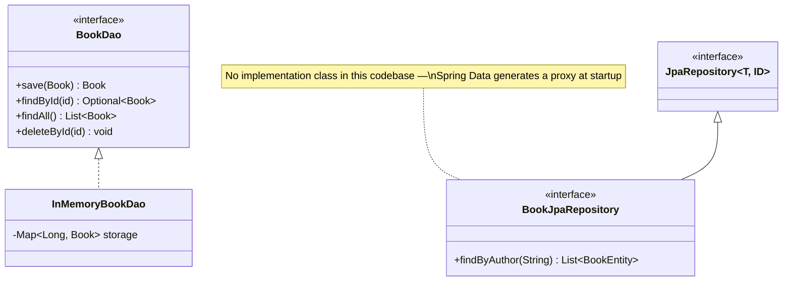
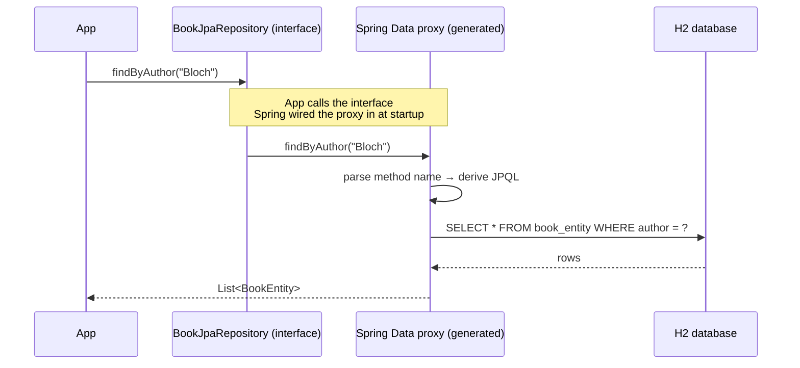

# 25 — Repository / DAO

**Category:** Capstone (Enterprise / Spring)
**Difficulty:** ★★★★☆

## Intent

Encapsulate all data-access logic (SQL, storage format, connection handling) behind a
collection-like interface, so the rest of the application talks to "a place I can save and fetch
objects" and never touches persistence details directly.

## Real-world analogy

A library's card catalog. A patron asks the catalog for "books by this author" — they don't need
to know whether the answer comes from a physical drawer of cards, a microfiche reader, or (today)
a database. The catalog interface stays the same even as what's behind it changes completely.

## UML





## Participants

| Class | Role |
|---|---|
| `plain/Book`, `plain/BookDao`, `plain/InMemoryBookDao` | Framework-free DAO — the pattern with nothing hidden |
| `spring/BookEntity` | JPA entity — a persistent domain object |
| `spring/BookJpaRepository` | Repository interface — **no implementation is ever written** |
| `spring/RepositoryDaoApplication` | Spring Boot app wiring both versions and running a demo |

## Why two implementations of the same idea

`plain/InMemoryBookDao` is the pattern with nothing hidden: a `Map` standing in for a table, and a
hand-written class implementing every method of `BookDao`. It exists so you can see exactly what
"repository" means before a framework generates one for you.

`spring/BookJpaRepository` is the same abstraction, but notice: **there is no
`BookJpaRepositoryImpl` class anywhere in this module.** `JpaRepository<BookEntity, Long>` already
supplies `save`, `findById`, `findAll`, `deleteById`; `findByAuthor(String)` is a **derived query**
— Spring Data parses the method name at startup and builds the JPQL for you. At runtime, Spring
generates a proxy implementing `BookJpaRepository` and wires it wherever the interface is injected.
This is the exact mechanism from `10-proxy`'s Spring AOP example — a generated stand-in object
implementing an interface — applied to data access instead of logging.

## When to use

- Any time persistence logic (SQL, an external API, a file format) would otherwise leak into
  business logic. Repository/DAO keeps `OrderService`, `UserService`, etc. persistence-ignorant.
- With Spring Data, whenever your query needs are expressible as CRUD + a handful of derived/JPQL
  queries — you get a correct, tested implementation for free.

## When to avoid

- Very simple scripts/tools with one obvious storage mechanism and no plan to swap it — the
  interface layer is pure ceremony there.
- Complex, highly dynamic, or performance-critical queries may be clearer as explicit JPQL/native
  SQL (`@Query`) or a query-builder than as ever-more-elaborate derived method names.

## Run it

```bash
./gradlew :25-repository-dao:test
./gradlew :25-repository-dao:bootRun
```

(This module uses the Spring Boot Gradle plugin, so the runnable task is `bootRun`, not `run`.)

## Related patterns

- **Proxy** (`10-proxy`) — the mechanism generating `BookJpaRepository`'s implementation at
  runtime.
- **Dependency Injection** (`24-dependency-injection`) — `BookJpaRepository` is injected into
  `RepositoryDaoApplication` the same way any other bean is.
- **Facade** (`08-facade`) — a repository is a narrow, purpose-built facade over a much larger and
  messier persistence API (JDBC/Hibernate).
