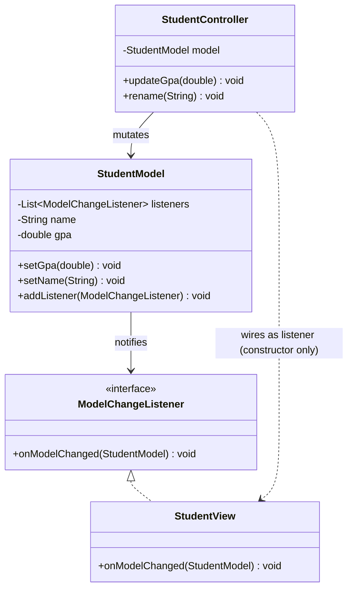
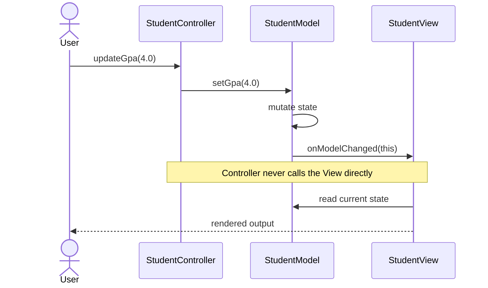
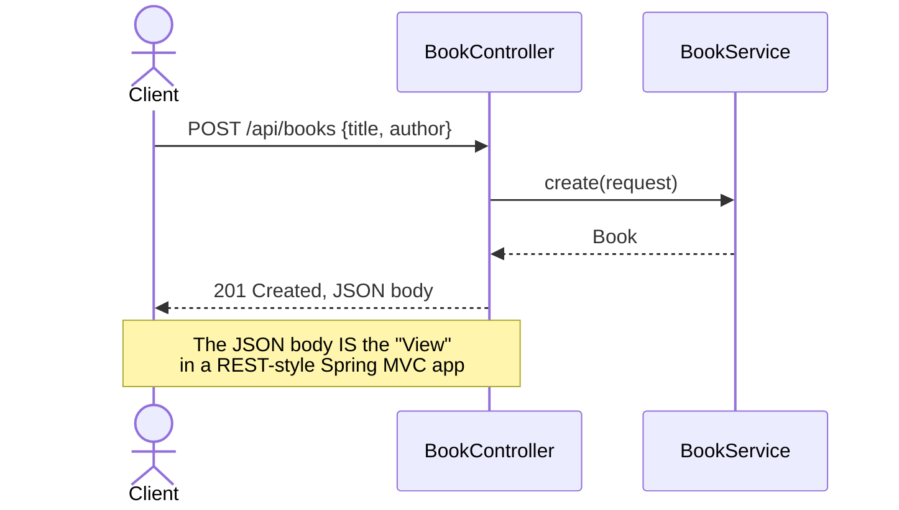

# 26 — Model-View-Controller (MVC)

**Category:** Capstone (Enterprise / Spring)
**Difficulty:** ★★★★☆

## Intent

Split an application into three responsibilities so each can change independently: the **Model**
holds state and business rules, the **View** presents state to the user, and the **Controller**
translates user input into changes on the Model. Critically, in the classic form, the View
observes the Model directly — the Controller updates the Model and then gets out of the way.

## Real-world analogy

A restaurant again, but a different slice of it: the kitchen (Model) prepares and holds the food
and knows nothing about how it's presented to a guest. The menu/plating (View) is just a
presentation of what the kitchen has. The waiter (Controller) takes the guest's order and tells
the kitchen what to prepare — the waiter doesn't plate the food or decide how it looks; that's the
kitchen and the presentation standard, not the waiter's job.

## UML







## Participants

| Class | Role |
|---|---|
| `classic/StudentModel` | Model — state + notifies listeners on change |
| `classic/StudentView` | View — observes the Model, renders, never mutates |
| `classic/StudentController` | Controller — the only class allowed to mutate the Model |
| `spring/BookService` | The "M" — business logic, zero HTTP awareness |
| `spring/BookController` | The "C" — translates HTTP ↔ service calls; JSON response is the "V" |

## Why two MVC demos

**`classic/`** is old-school desktop-app MVC, deliberately built on the same Observer relationship
as `14-observer`: the View is a `ModelChangeListener` registered on the Model, and the Controller's
*only* job is calling mutator methods on the Model in response to input. The Controller never
calls a render method on the View directly — that would collapse the separation. This is the
version of MVC Trygve Reenskaug originally described at Xerox PARC for Smalltalk desktop UIs.

**`spring/`** is what "MVC" means in almost every modern Java job: a `@RestController` (View +
Controller responsibilities blended — Spring resolves the "View" by serializing the return value
straight to JSON) delegating to a `@Service` (the Model / business logic layer). There's no
separate `BookView` class because a REST API's response body *is* the view; a server-rendered app
(Thymeleaf, JSP) would add an actual View-resolution step back in, choosing a template by name,
but the Controller → Service split stays identical either way. Run `BookControllerTest` to see the
whole request/response cycle exercised over real HTTP via `TestRestTemplate`.

## When to use

- Any application with a UI (desktop, web, or API) where you want to change presentation without
  touching business logic, or vice versa.
- REST APIs specifically: keep Controllers thin (HTTP translation only) and push all logic into
  Services — that's this pattern, even without a visible "View" class.

## When to avoid

- A tiny script or a single CLI command doesn't need three formal layers — that's needless
  ceremony for something with no real "presentation" concern.
- Watch for "fat controllers" — business logic creeping into `@RestController` methods defeats the
  entire point of the split. If `BookController` started containing validation rules or persistence
  logic, that logic belongs in `BookService`.

## Run it

```bash
./gradlew :26-mvc:test        # classic MVC tests + full HTTP round-trip test
./gradlew :26-mvc:bootRun     # starts the REST API on :8080 — try:
                               #   curl -X POST localhost:8080/api/books -H "Content-Type: application/json" -d '{"title":"Dune","author":"Frank Herbert"}'
                               #   curl localhost:8080/api/books
```

(This module uses the Spring Boot Gradle plugin, so the runnable task is `bootRun`, not `run`.)

## Related patterns

- **Observer** (`14-observer`) — the mechanism connecting `classic/StudentModel` to
  `classic/StudentView`.
- **Facade** (`08-facade`) — `BookController` is a thin facade translating HTTP into service
  calls.
- **Dependency Injection** (`24-dependency-injection`) — `BookController` and `BookService` are
  both container-managed beans, wired the same way as every other Spring example in this repo.
