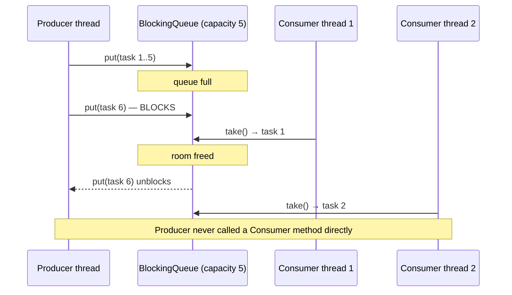

# 27 — Producer-Consumer

**Category:** Capstone (Concurrency)
**Difficulty:** ★★★★☆ (final module — start here only after the rest of the curriculum)

## Intent

Decouple the thread(s) generating work from the thread(s) doing that work by connecting them
through a shared, thread-safe queue instead of direct calls. Producers never block on consumers
being ready; consumers never need to know who produced what. A **bounded** queue additionally
gives you backpressure for free: a fast producer is throttled automatically when the queue fills,
instead of memory growing without limit.

## Real-world analogy

A restaurant kitchen's order rail. Waiters (producers) clip order tickets onto the rail and walk
away — they don't wait for a cook to be free. Cooks (consumers) pull the next ticket whenever
they finish the last one. If the rail has limited space and it's full, waiters have to wait a
moment before clipping a new ticket — that's the backpressure. Neither side needs to know how many
of the other there are.

## UML

```mermaid
classDiagram
    class Producer {
        -BlockingQueue~Task~ queue
        +run() void
    }
    class Consumer {
        -BlockingQueue~Task~ queue
        +run() void
    }
    class Task {
        +int id
        +String payload
    }
    Producer ..> Task : creates
    Producer --> "BlockingQueue~Task~" : put()
    Consumer --> "BlockingQueue~Task~" : take()
    Consumer ..> Task : processes
```



## Participants

| Class | Role |
|---|---|
| `Task` | The unit of work passed through the queue |
| `Producer` | Generates tasks, `put()`s them onto the queue (blocks if full) |
| `Consumer` | `take()`s tasks off the queue (blocks if empty), processes them |
| `Consumer.POISON_PILL` | Sentinel value signaling a consumer to stop |

## Why a poison pill, and why one per consumer

`BlockingQueue.take()` blocks forever if the queue is empty — there's no built-in "I'm done"
signal. The classic fix is a **poison pill**: a sentinel `Task` (compared by reference identity,
never mistaken for real data) that means "stop." `Producer` sends exactly `consumerCount` poison
pills after its real work, so every consumer thread — not just one — gets told to shut down;
without that, `consumerCount - 1` threads would sit blocked on `take()` forever after the first one
exits.

## Why a *bounded* queue specifically

An unbounded queue (`LinkedBlockingQueue` with no capacity) decouples producer and consumer
completely, but if the producer is faster than the consumers can drain, the queue grows without
limit — an unbounded memory leak under load. `ArrayBlockingQueue(5)` in this demo makes the
producer's `put()` block once 5 tasks are pending, which naturally slows the producer down to the
consumers' pace. This throttling behavior is the concrete, testable difference between "just use a
queue" and actually applying the Producer-Consumer pattern deliberately.

## When to use

- Any pipeline where work arrives faster or slower than it can be processed, and you want the
  faster side throttled rather than buffering unboundedly (log ingestion, task queues, I/O
  batching).
- Decoupling *what generates work* from *how many workers process it* — scale consumer count
  independently of producer count.

## When to avoid

- Simple synchronous request/response flows have no need for this — a queue adds latency and
  complexity where a direct call would do.
- If work must be processed in strict order by a single thread with no concurrency benefit, this
  pattern's parallelism is pure overhead.
- In modern code, prefer `java.util.concurrent.ExecutorService`'s own work queue, or a
  purpose-built library (Project Reactor, Kafka, etc.) over hand-rolling this — this module builds
  it from `BlockingQueue` directly specifically so the mechanics aren't hidden.

## Run it

```bash
./gradlew :27-producer-consumer:test
./gradlew :27-producer-consumer:run
```

## Related patterns

- **Observer** (`14-observer`) — also decouples a source of events from things reacting to them,
  but synchronously and in-process, with no thread hand-off or buffering.
- **Command** (`16-command`) — a `Task` here is conceptually similar to a `Command`: a
  self-contained unit of work handed to something else to execute.
