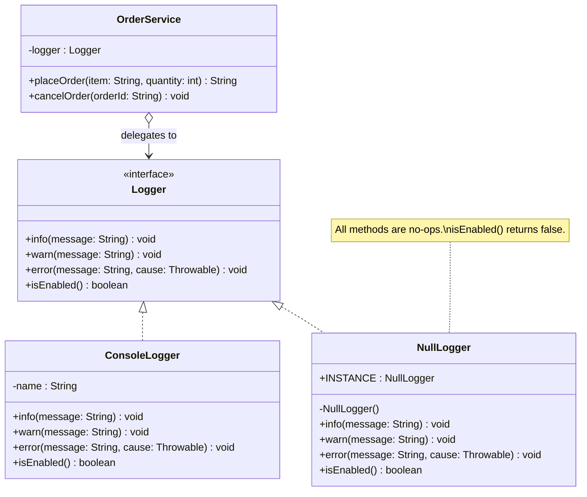
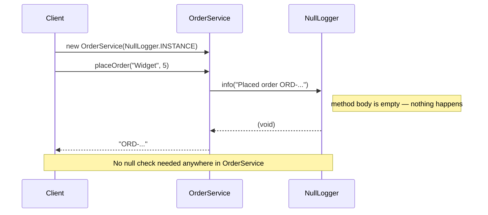

# 28 — Null Object

**Category:** Behavioral
**Difficulty:** ★☆☆☆☆

## Intent

Provide an object that implements an interface but does nothing, so that callers can treat
the absence of a real object exactly like the presence of one — without ever writing
`if (x != null)`.

## Real-world analogy

A TV remote control can be programmed to "do nothing" on unused buttons — pressing them doesn't
crash the TV, they just silently swallow the keypress. The TV's internal code never has to check
"is there a handler for this button?"; it calls `handler.execute()` and moves on. A missing handler
is represented by a handler that exists but does nothing.

## UML





## Participants

| Class | Role |
|---|---|
| `Logger` | The abstraction whose absence we want to represent |
| `ConsoleLogger` | Real implementation — logs to stdout |
| `NullLogger` | Null Object — implements `Logger` with no-op methods; singleton |
| `OrderService` | Client — uses `Logger` unconditionally, never guards with `!= null` |

## Why is this a pattern and not just "don't pass null"?

The naive alternative is to litter the client code with guards:

```java
// WITHOUT Null Object — noise in every method that uses the logger
if (logger != null) {
    logger.info("Placed order " + orderId);
}
```

Every collaborator that might be absent generates the same boilerplate. The pattern inverts the
responsibility: instead of the *client* defending against null, an object is provided that *is*
the absence — and it fulfils the same contract the real object would. Client code becomes
unconditional, shorter, and easier to read:

```java
// WITH Null Object — clean unconditional code
logger.info("Placed order " + orderId);   // works whether logger is real or NullLogger
```

There is also a testability benefit: unit tests that don't care about logging inject
`NullLogger.INSTANCE` and never have to set up or verify a mock logger, keeping tests focused on
the behaviour that matters.

## When to use

- An optional collaborator has many call sites and guarding each one is noisy.
- You want tests to ignore a side-effectful dependency (logging, metrics, notifications) without
  setting up mocks for it.
- You want to express "disabled" cleanly — e.g., a no-op cache, a silent event publisher, or a
  stub repository that returns empty results.

## When to avoid

- If callers genuinely need to know whether the object is absent (`isEnabled()`, `isPresent()`)
  and take different control-flow paths based on that — the null object reduces null checks but
  does not remove all branching.
- `Optional<T>` is a better fit when the absence is at a *return value* boundary and the caller
  decides what to do; the Null Object is better when the absence is at a *dependency injection*
  boundary and the object decides to do nothing.

## Run it

```bash
./gradlew :28-null-object:test
./gradlew :28-null-object:run
```

## Related patterns

- **Strategy** (`13-strategy`) has the same class shape — a context holds a reference to an
  interchangeable collaborator. A Null Object is often the "do nothing" strategy in a strategy
  family.
- **Singleton** (`01-singleton`) — `NullLogger.INSTANCE` is a singleton; there's only ever one
  "nothing" to share.
- **Proxy** (`10-proxy`) wraps an object to control access; a Null Object *replaces* an absent
  object rather than wrapping a present one.
