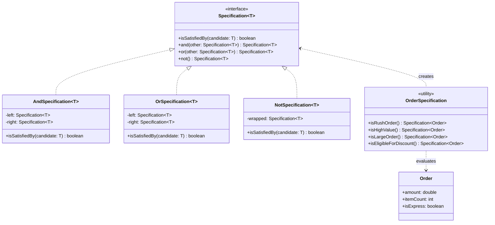
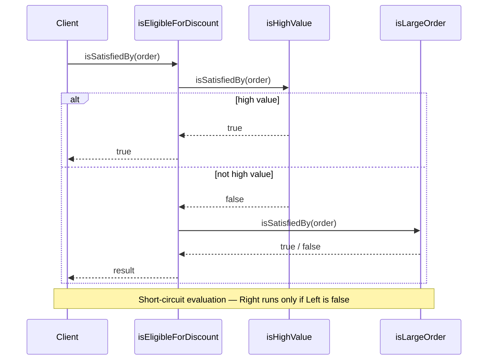

# 29 — Specification

**Category:** Enterprise / DDD
**Difficulty:** ★★★☆☆

## Intent

Encapsulate a business rule into a reusable object that can be combined with other rules
using boolean logic (`and`, `or`, `not`) — without writing `if`/`else` branches scattered
across services and queries.

## Real-world analogy

An airport security checkpoint has a set of rules: "passenger has a valid boarding pass",
"passenger ID matches the ticket", "liquids are under 100ml". Each rule can be checked
independently. A supervisor can compose them: a passenger *must* pass *all* rules.
When regulations change (e.g., electronics screening), you add or modify one rule object
without touching the others.

## UML





## Participants

| Class | Role |
|---|---|
| `Specification<T>` | Interface: `isSatisfiedBy(T)`, combinators `and()`, `or()`, `not()` |
| `AndSpecification<T>` | Composite — both left and right must be satisfied |
| `OrSpecification<T>` | Composite — at least one must be satisfied |
| `NotSpecification<T>` | Composite — negates the wrapped spec |
| `OrderSpecification` | Factory for named business rules |
| `Order` | Domain object being evaluated |

## Why is this a pattern and not just inline `if` statements?

Without the pattern, business logic looks like this:

```java
if (order.isExpress() && order.getAmount() > 500) {  /* rush order processing */ }
if (order.getAmount() > 1000 || order.getItemCount() > 20) { /* discount */ }
```

Problems:
- Business rules are duplicated across methods and services.
- There is no single place to read "what makes an order eligible for a discount?".
- Composite logic (rush AND high-value) OR large-order requires nesting that is hard to
  read and impossible to reuse.

The pattern encapsulates each rule as a named object:

```java
Specification<Order> discount = OrderSpecification.isEligibleForDiscount();
if (discount.isSatisfiedBy(order)) { /* apply discount */ }
```

Rules become named, reusable, composable, and testable in isolation.

## When to use

- Business rules cross multiple domain attributes and appear in many places.
- You want to compose rules dynamically (e.g., user-configurable promotions).
- You want to express rules in the ubiquitous language of the domain
  ("an order is eligible for discount" rather than `amount > 1000 || items > 20`).
- You're already using the Repository pattern and want to pass specs into queries.

## When to avoid

- A single conditional that appears in only one place — inline `if` is clearer.
- The overhead of a class hierarchy is not justified for one-off rules.
- The rule logic crosses object graphs that cannot be evaluated in memory
  (you may need a query-level spec that translates to SQL).

## Run it

```bash
./gradlew :29-specification:test
./gradlew :29-specification:run
```

## Related patterns

- **Composite** (`09-composite`) shares the same tree structure — specs are composites
  with leaves as concrete rules and nodes as logical operators.
- **Strategy** (`13-strategy`) also encapsulates a family of algorithms; a Specification
  can be thought of as a Strategy for a boolean evaluation.
- **Repository / DAO** (`25-repository-dao`) — Specifications can be passed to Repository
  queries to translate rules into WHERE clauses.
- **Visitor** (`22-visitor`) — a Visitor could traverse a specification AST to generate
  SQL or a human-readable description.
